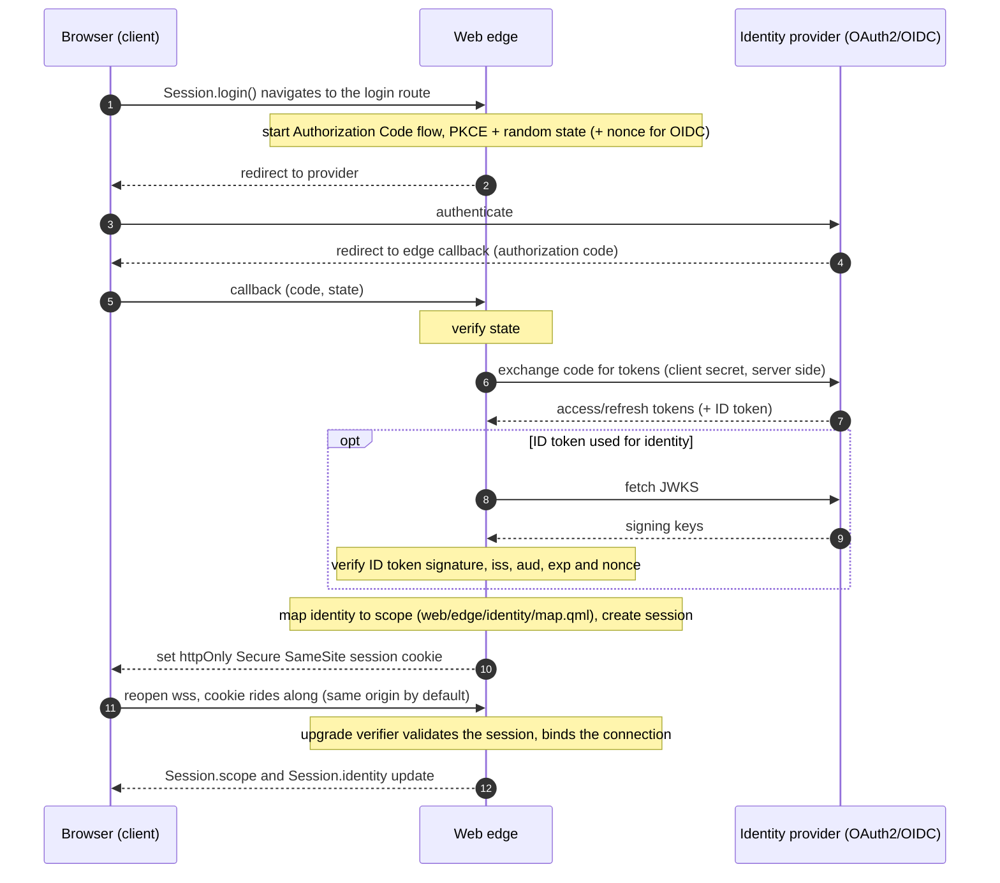

<!-- SPDX-FileCopyrightText: 2026 Alexandre 'kidev' Poumaroux -->
<!-- SPDX-License-Identifier: Apache-2.0 -->

# Authentication and identity

This page covers how SynQt makes user login a one command, secure by default
capability, the reasoning behind each default, the distinction between user identity
and entity identity, and the session lifecycle. The security rationale here is the
same as in [security](security.md); this page is the practical version of it.

## Secure defaults, with no insecure state to get stuck in

Authentication has a gap between "it works" and "it is safe." Many systems reach a
working login that is quietly insecure (a token in local storage, a secret in the
browser bundle, a missing CSRF defense, a cookie without the right flags) and never
close the gap because the demo already worked.

In SynQt the default path is the secure path, and there is no
working but insecure intermediate state to get stuck in. The single command that
adds auth produces a configuration that is already hardened. You can widen it
deliberately, but you never have to remember to add the protections, because they
are on from the first run. The reasoning is that every security control that is opt
in will be forgotten by someone, so the controls that matter must be opt out,
visible, and justified when removed.

Concretely, the defaults baked in by `synqt add auth`:

- The Authorization Code flow with PKCE (on by default in Qt since 6.8), run
  entirely on the web edge. The browser never holds a client secret.
- A random state value on every authorization request (CSRF defense). The framework
  generates it itself with a cryptographic RNG and verifies it on the callback. Qt
  6.12 does generate one when none is set, and the framework still sets its own,
  because the state is also the key the pending login is filed under. The PKCE
  verifier, the OIDC nonce and the browser binding are stored against it before the
  browser ever leaves, and the callback is answered by looking the state up and
  finding them. A value the framework only learns after the request
  is built cannot be that key.
- A session credential delivered as an httpOnly, Secure, SameSite cookie. httpOnly
  keeps it unreadable by page script (so a cross site scripting bug cannot steal
  it); Secure keeps it on TLS only; SameSite blunts cross site request forgery.
- Access, refresh, and ID tokens kept on the edge, associated with the session,
  never sent to the browser, never logged.
- ID token signature verification against the provider JWKS when ID tokens are used
  for identity, because Qt does not verify ID tokens out of the box. Qt also has no
  JWT or JWKS API at all, so the framework performs the verification with the
  pinned `jwt-cpp` library (MIT, via vcpkg), fetching and caching the provider JWKS
  with QNetworkAccessManager; no hand rolled cryptography.
- A nonce on every OpenID Connect authorization request, checked against the `nonce`
  claim of the ID token that comes back. It is what binds that token to this login
  rather than to one replayed from somewhere else, and it is a separate control from
  the state above: state protects the callback, the nonce protects the token. Exactly
  one is sent, which is worth saying because Qt adds one of its own whenever the scope
  contains `openid`: the framework hands Qt its own random value rather than a second
  parameter beside it, since a request carrying `nonce` twice is malformed
  ([RFC 6749 section 3.1](https://www.rfc-editor.org/rfc/rfc6749#section-3.1)) and a
  provider that enforces that refuses the login outright.
- Session expiry and rotation: a bounded lifetime, and a fresh session id when
  privilege changes, to limit the value of a stolen session and prevent session
  fixation.
- Login rate limiting and the same origin and upgrade checks the rest of the system
  uses.

None of these has to be wired by hand; they are the output of the command.

## Adding auth: one command

```cli
synqt add auth github
```

This:

1. Writes the `identity` section and an entry under `identity.providers` for the
   named provider with the secure defaults above (see the
   [`synqt.yaml` schema](project-layout-and-config.md#the-synqtyaml-schema)).
2. Adds the provider's `client_secret` as an `env:` reference and writes a
   `.env.example` entry so the required secret is documented but unset.
3. Scaffolds the callback and login routes on the web edge.
4. Scaffolds an identity mapping hook (`web/edge/identity/map.qml`) that returns the
   default scope, ready for you to map specific identities to higher scopes.
5. Prints exactly what you must do next (register the OAuth app with the provider,
   set the redirect URL to the edge callback, put the secret in the edge `.env`)
   and nothing else.

Two providers are templated by name, `github` and `google`; any other name is written as
a generic OpenID Connect entry whose issuer and endpoints you point at the provider.

To require login for the whole app rather than allow anonymous read:

```cli
synqt add auth github --required
```

which sets `identity.required: true`, so an unauthenticated browser cannot acquire
any scoped connect point and is sent to login first.

## The development sign-in

Registering an OAuth app is not something to do on the first afternoon of a project, and
until it is done there is no way to reach a scope-gated route at all. So `synqt dev` can
run a provider of its own:

```cli
synqt add auth dev
```

which writes one block:

```yaml
identity:
  dev_stub:
    users:
      - { sub: dev, login: dev, name: Developer, email: dev@localhost }
      - { sub: mod, login: mod, name: Moderator, email: moderator@localhost }
```

That is the whole configuration. The provider entry it becomes is written by the
framework, because every field of it follows from where the server is: the endpoints are
its own routes on `127.0.0.1`, the issuer is the address it answers at, and the client id
is a constant. `port` is the one thing you may want to move, and `synqt check` refuses a
value another entity already serves on.

**Nothing about the login is faked except the provider.** The random state, the PKCE
challenge, the code exchange, the ID token and its signature check against the JWKS, the
[mapping hook](#the-identity-mapping-hook), the session and its httpOnly cookie are the
ones a real provider's login goes through. A development sign-in that took a shortcut past
the flow would be exercising something other than what ships.

It is also why a dev user is an *identity* rather than a scope. Sign in as one of the
people above and you get whatever your own `map.qml` returns for them, so to reach
`moderator` you add somebody your hook maps there. With more than one person configured
the sign-in asks which of them you are; with exactly one it does not ask.

Gates keep it out of anything that ships, and they are independent:

- The sources are not compiled into a release build at all. `src/edge/CMakeLists.txt`
  names them only under `SYNQT_DEV_TOOLS`, which `synqt dev` sets and `synqt build` never
  does, and the header refuses to be included by a build that did not. See
  [Development code is absent from a release build](security.md#development-code-is-absent-from-a-release-build).
- The server starts only under `--dev`. `synqt dev` passes it; `synqt build`, `synqt
  serve`, a systemd unit and a container never do.
- `StubIdentityServer` refuses to be constructed without an acknowledgement that can only
  be written on purpose, so it cannot be reached by accident from anywhere else.
- The runtime refuses the provider entry itself unless the same flag is set. An edge that
  somehow held the server would still sign nobody in; the login route answers 403.

`synqt check --release` reports that a project carries one, and says that it is inert
rather than refusing the build, because leaving the block in place is the ordinary thing
to do: the development sign-in and the real provider live side by side, and which one a
visitor gets is decided by how the edge was started.

### Skipping the flow: the scope picker

The development sign-in above proves the flow. Sometimes what you want is the opposite:
not to run the flow at all, just to be a moderator for the next thirty seconds and see
what the page looks like.

```cli
synqt dev --identity-picker
```

replaces every sign-in the project has with one page at `/synqt/dev/identity` listing the
scopes in `scopes.order`. Click one and you hold a session at it, with a synthesized
identity whose `sub` is `synqt-dev:<scope>:<epoch-ms>` so it can never collide with
anything a real provider issues.

It skips OAuth entirely: no PKCE, no code exchange, no ID token, no JWKS, and the mapping
hook is not consulted, because picking the scope directly is the point. That is why
`identity.dev_stub` stays beside it rather than being replaced by it. **The stub proves
the flow; the picker skips it.** Reach for the stub when the question is about signing in
and for the picker when the question is about what a scope can see.

The chosen scope is still bounds-checked against `scopes.order`, so editing the form and
posting a larger number does not mint a scope the project never declared.

### Being somebody in particular: `.dev-identities`

Picking a scope covers "let me be an admin for a minute". It does not cover "let me be
Alice again", which is what working on anything keyed to a person actually looks like. A
`.dev-identities` file at the project root is that list:

```yaml
- email: alice@example.com
  scope: admin
- email: bob@example.com
  scope: user
```

The picker offers each of them beside the scopes. Clicking one signs you in as that
person: `sub` is `synqt-dev:<email>`, so it is stable across restarts and a project that
stores rows against a `sub` sees the same person on the next run.

Unlike the scope mode, **the mapping hook is consulted**, because seeing what your own
rule makes of somebody is the reason to name them. The scope in the file is what the
picker lists; the hook's answer is what the session gets. Where they differ the page shows
both, and where the hook refuses the identity the picker refuses it too: a development
sign-in that granted what the project's own rule denies would be a shortcut to a state the
application cannot reach. A project with no mapping hook has nothing to ask, and the page
says so rather than letting the file's scope read as an answer the hook agreed with.

The file is read by `synqt dev`, not by the edge: that side already parses YAML and
already knows which scopes the project declares, so what reaches the edge is a checked
list. An entry that names an undeclared scope, or is missing a field, is dropped and
reported on the picker's own page (and in the terminal), never taken as a reason to stop
serving the picker. A typo in a convenience file should cost you the entry, not the
sign-in.

`synqt dev` adds `.dev-identities` to the project's `.gitignore` the first time it reads
one. It names the people who work on one machine; committing it would put a colleague's
address in the repository and hand every clone a picker offering names that mean nothing
on it.

### Two tabs, two people

Tick **this tab only** and the session is scoped to the tab you clicked in, so you can
hold two identities in one browser and watch them interact: a moderator deleting the
message a user is looking at, in two tabs side by side, without a second browser profile
or a private window.

The mechanism is the cookie's *name*. RFC 6265 scopes a cookie to a host and not a port,
so two tabs on one host share one jar however they were opened, and there is no other axis
available: the WebSocket subprotocol alternative is not reachable on Qt 6.12
(`tests/m5-webedge/tst_m5.cpp::theUpgradePathCannotNegotiateASubprotocol` pins that). So a
per-tab choice sends the tab to `/?s=<nonce>` and puts its session under
`synqt_session_<nonce>`; the edge reads `s` from the page request and from the sync URL to
know which of the cookies in the jar is this tab's.

The nonce is not a credential and nothing treats it as one. It names which cookie to read,
and the cookie still holds the session id, which is the thing anybody would have to steal.
It is validated on arrival, because it becomes part of a cookie name in a `Set-Cookie`
header and a value carrying a `;` or a newline would write attributes, or a second header,
that nothing intended.

## Two identities, never conflated

SynQt has two separate identity systems. Keeping them distinct is itself a security
property.

User identity. Who the person using the browser is. Established by the OAuth2 or
OpenID Connect flow on the web edge, expressed as a session with a scope. Used to
authorize browser originated calls (`Caller.isUser`, `Caller.session`,
`Caller.scope`). This is what `synqt add auth` configures.

Entity identity. Which service is calling which over the mesh. Established by the
mutual TLS certificate each entity holds (its entity name is the certificate
subject), on every mesh link by default, same host (over loopback) or cross host.
(An opt in local socket link instead trusts colocation and is for equally trusted
co located processes only; see [security](security.md).) Used to
authorize entity originated calls (`Caller.isEntity`, `Caller.entity`). This is
configured by the mesh CA and per entity certs (see
[`[mesh]`](project-layout-and-config.md#mesh-service-to-service-security) and
[security](security.md)), not by `synqt add auth`.

A browser user is never an entity, and an entity is never a browser user. A
database slot that checks `Caller.entity === "edge"` is authorizing a service, not a
person. An edge slot that checks `Caller.hasScope("admin")` is authorizing a
person, not a service. Mixing them up (for example trusting a user supplied value as
if it were an entity identity) is the kind of error the separation is designed to
prevent.

## The login flow, end to end



The browser only ever holds the opaque session cookie. Every token stays on the
edge.

A [native desktop client](desktop.md#signing-in) runs the same flow with one
difference at the end: it has no origin for a cookie to be set on, so the edge
redirects the system browser to a loopback port the app is listening on and hands
back a one-time claim code, which the app exchanges for the session over its own
connection. Everything before that step, including where the secret lives, is
unchanged. The edge serves that exchange at `<login route>/claim`, and only when a
client entity lists the `desktop` target.

## The identity object

Every authenticated session carries a normalized identity, so app code and the
mapping hook read the same fields whatever the provider:

- `identity.sub`: the stable subject. For OpenID Connect providers this is the
  verified ID token's `sub` claim; for plain OAuth2 providers the provider template
  maps the provider's stable user id into it (GitHub: the numeric `id`). Key
  durable ownership on this (as the examples do), never on an email or display
  name, which can change.
- `identity.login`: the provider username (GitHub: `login`), when the provider has
  one.
- `identity.name`: the display name, when the provider has one.
- `identity.email`: the verified email address, or null. Some providers withhold
  it: a GitHub account with a private email returns none from `/user`, so the
  GitHub template requests the `user:email` scope and falls back to the primary
  verified address from the emails endpoint, and still ends with null if the user
  granted nothing. Code and mapping hooks must tolerate a null email; prefer `sub`
  or `login` for authorization decisions.

Provider templates own this mapping, and each documents which raw provider fields
feed each normalized one. A custom provider block does the same in its
configuration.

## The identity mapping hook

`web/edge/identity/map.qml` turns a provider identity into a SynQt scope. It runs only
on the edge, after a successful login. A project that signs anybody in has to have one,
and has to declare its `scopes.order`; `synqt check` refuses a project missing either,
because without them nothing decides what scope a session holds and every login fails.

```qml
import SynQt

IdentityMapping {
    function scopeFor(identity): int {
        const admins     = ["owner@example.com"]
        const moderators = ["mod@example.com"]
        if (admins.indexOf(identity.email) !== -1)     return Scope.Admin
        if (moderators.indexOf(identity.email) !== -1) return Scope.Moderator
        return Scope.User   // any successfully authenticated user
    }
}
```

The return value is a member of `Scope`, an enum SynQt generates from
`scopes.order` and writes beside this file, so the hook needs no import to reach it. A
member's value is the scope's index in `scopes.order`, which is also its authority rank
under `scopes.hierarchical`, and the edge resolves the answer by that index rather than
by name. Two things follow, and both are the point of it being an enum rather than a
string: a scope the project never declared cannot be spelled here at all, and `synqt
check` refuses a member the generator would not have written, naming the file and line.
An answer the edge cannot place, from a hook that was not regenerated or one that failed
to load, refuses the login and says so in the edge's log. There is no fallback scope: a
login that cannot be given a declared scope fails rather than being given one nobody
wrote down.

For systems where roles live in a database, the hook can read a connect point the
edge consumes (for example a `prop var assignments` the roles entity pushes, looked
up as `Store.assignments[identity.sub]`), so role assignment is data driven
rather than hard coded. Read a pushed property, not a returning slot: `scopeFor` runs
synchronously, because the edge needs the scope before it can create the session, and
a returning slot hands back a promise instead of a value.
[An identity service of your own](tutorial-advanced-identity.md) works through this
and the two customizations either side of it.

## Session lifecycle

- Creation. A session is created on successful login, with a bounded lifetime
  (`identity.session.ttl_minutes`).
- Rotation. The session id is rotated when privilege changes (for example after a
  scope upgrade), preventing session fixation.
- Refresh. When the provider issues a refresh token, the access token is renewed
  server side without involving the browser, by whichever entity holds the tokens (the
  edge, or the auth entity when `provider_entity` is set). Every
  `identity.refresh.interval_seconds` (60 by default) it renews anything within
  `identity.refresh.margin_seconds` (120) of expiring. Widen the margin for a provider
  that issues short lived tokens; a non-positive interval turns the sweep off.
- Expiry and revocation. A session expires at its TTL or can be revoked (logout, or
  an administrative action). A revoked or expired session fails the upgrade
  verifier, and the client retries with its backoff as it would against an edge
  that is down: the browser does not report a handshake's status code, so the two
  are not distinguishable from inside the client. The session it reconnects with is
  anonymous, so `Session.isAuthenticated` goes false and every scope-gated Replica
  is released, which is the signal an app routes back to login on.
- Logout. `Session.logout()` calls the edge logout route, which clears the session
  server side and expires the cookie. The edge closes the browser connections that
  session authorized as it revokes it, so nothing goes on being pushed to a tab that
  signed out, and the client comes back as an anonymous visitor.

None of that changes for a desktop app that stays signed in between launches
(`identity.desktop_session: device`). What it keeps in the OS secure store is not a
session: it is a single-use credential it spends at the next launch for a session of
exactly the length above, so the TTL, the rotation and the revocation here are the
same numbers either way. See
[storing the session](desktop.md#storing-the-session).

## Where identity runs: at the edge, or as its own entity

By default identity runs in process on the web edge. This is the simplest and is
right for most systems: one edge, one place that holds tokens and issues sessions.

For larger systems with several edges or services that all need a common notion of
sessions, identity can be promoted to a dedicated auth entity by setting
`identity.provider_entity` to that entity's name. The auth entity owns the identity
and session connect points; the edges consume them over the mesh (mutually
authenticated like any mesh link). This centralizes token handling and session
state behind one internal service, and keeps the secrets in one place. The user
facing flow is unchanged; only where the session state lives moves. Promoting to an
auth entity is a configuration change, not a rewrite, because the edge already
talks to identity through a connect point boundary.

It is what a [replicated edge](deploying.md#8-running-more-than-one-edge) requires, and
`synqt check` refuses `replicas: > 1` without it. Four things move with it, and only the
first is obvious: the session table, so a visitor is not signed in on one replica and
anonymous on the next; the hand-off a scope change leaves behind, so a visitor whose
session `Caller.setScope` rotated on one replica is handed the new credential on their
next page load whichever replica it lands on, rather than a fresh anonymous session; the
pending login, so the OAuth callback can be answered by whichever process the balancer
sends it to rather than only the one that began it; and the desktop claim code, which the
native client redeems over a connection of its own that lands independently of the browser
that produced it. Every replica presents one entity identity, so the auth entity is
answering one consumer that happens to be several processes.

It is also one line, because everything the line implies is generated. Declare
the entity, name it, and `synqt build` writes the two connect points (`identity` and
`sessions`, one Source per caller so one edge's answer never reaches another), the Source QML that
bridges each to its engine, and the entity's `main.cpp` holding the OAuth engine and the
authoritative session store. Their contracts ship in the runtime library, so no project
writes an `export:` for them and none has to.

```yaml
entities:
  - name: auth          # an ordinary service entity; it declares no connect points
    type: service

identity:
  provider_entity: auth
  providers:
    - name: github
      client_id: your-client-id
      client_secret: env:GITHUB_CLIENT_SECRET   # now the AUTH entity's .env, not the edge's
```

The promoted edge is given provider *names* and nothing else: no client id, no provider
endpoint, no client secret, and no token. It keeps the browser facing half (the login and
callback routes, the origin and session checks, the cookie) and asks the auth entity over
the mesh for every step that needs a secret. The scope mapping hook stays on the edge too:
the auth entity establishes who someone is, and each edge decides what that means in its
own system.

## What the developer is responsible for

The framework provides secure defaults; a few things remain the developer's job and
the scaffold says so explicitly:

- Register the OAuth application with the provider and set its redirect URL to the
  edge callback.
- Put the real client secret in the edge `.env` (never in `synqt.yaml`, never in a
  client target).
- Decide the scope mapping in the identity hook.
- Decide whether the app allows anonymous read (`identity.required: false`) or
  requires login for everything (`true`).

Everything else (PKCE, state, the cookie flags, server side token storage, ID token
verification, rotation, expiry, the origin and upgrade checks) is on by default and
does not depend on the developer remembering it.
