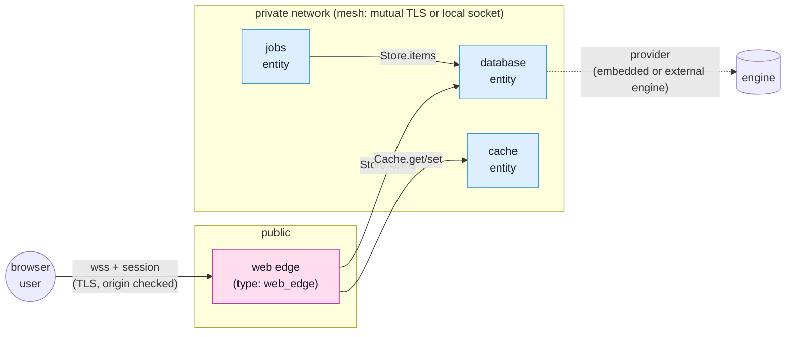

# Entities

This page is the depth reference for the entity model: what an entity is, the
types, the official entity types SynQt ships so common needs are
one command away, and how to build a custom entity. It assumes the programming
model in [programming model](programming-model.md) and the topology config in
[project layout and configuration](project-layout-and-config.md).

## What an entity is

An entity is a unit of a SynQt system with:

- a unique name (its identity in the topology and, for cross host links, the
  subject of its mesh certificate),
- a folder of its own,
- a type (one word: what it is),
- a binary of its own (WebAssembly for a client, native for everything else),
- a set of connect points it owns and a set it consumes,
- a place in the deny by default topology and a transport binding.

Entities are how SynQt lets you build a whole system (UI, edge, storage, cache,
integrations) in one framework, one toolchain, and one security model. Postgres,
Redis, and a gateway become three SynQt entities sharing the contract format, the
mesh transport, and the mutual TLS identity model, rather than three external
systems each configured and secured on its own.

A typical system as a topology, with the internet on the left and the internal
mesh on the right:



Only the web edge faces the internet. Every other entity is private and reachable
only over the authenticated mesh, by the entities the topology allows. A database
entity's actual engine sits behind a provider ([Official entity types](#official-entity-types)
below and [providers](providers.md)).

## The one field: `type`

`type:` decides the folder the entity lives in, the helper the runtime puts in its QML,
whether it faces the internet, and whether it is compiled native or to WebAssembly. An
entity that names no type is a `service`.

`type: client`:

- Compiled to WebAssembly, runs in the browser, untrusted, connect only.
- Reaches exactly one web edge over wss. Never participates in the mesh.
- A project has at least one. Multiple client entities (for example a separate
  admin app) are a later version feature; the model already allows naming more
  than one.

`type: web_edge`:

- A native binary that serves the client bundle and accepts that client's wss
  connection. It is the only entity exposed to the internet, and a project has one.

Every other type is a native binary that listens and connects on the mesh only, reachable
by the entities the topology allows and by nobody else. `relational`, `document` and
`cache` each come with an engine behind a provider; `api` and `jobs` come with a helper and
no engine; `service` is the plain one, with neither.

A typical system: one `client`, one `web_edge`, and one or more internal entities
(database, cache, document store, api, jobs, auth).

## Official entity types

An entity type is a prebuilt entity you instantiate with
`synqt add entity <name> --type <type>`. It scaffolds the entity folder, its
config block, its contracts, and its secure defaults. The types are part of the
framework and are reviewed; using one does not pull in an unaudited third party.

### Persistence (the database entity)

Purpose: durable storage, owned by one entity, reachable only by the entities you
authorize.

Backend: a provider. The default provider is Qt SQL with the bundled SQLite driver
(QSQLITE), the in process database with the best test coverage and platform support
in Qt, running no separate daemon. The storage is an embedded library inside a SynQt
entity rather than a separate server to operate. The same entity can instead be backed
by a third party engine
(PostgreSQL, MySQL, and others, or a document engine through the document entity type)
by selecting a provider, with the connect points and every consumer unchanged. The
provider system, the available engines, and their security are the subject of
[providers](providers.md). This section describes the default embedded provider, which
is what a fresh project uses with no configuration.

The type provides a `Db` helper exposed to the entity's QML for parameterized
queries (always parameterized, never string built, to prevent SQL injection). With
the SQLite provider it talks to the embedded engine; with another relational
provider it talks to that engine through the same helper. The connect point declares a
model whose listed roles are all that ever reach a consumer, and the generated Source
exposes `set<Model>` to publish rows (see
[the programming model](programming-model.md#contracts-the-shape-of-what-may-cross)):

```yaml
connect_points:
  - owner: store
    consumers: [edge]
    export: |
      record ItemRow(string[280] text, string[80] author, string[64] ownerSub)
      model rows(string[280] text, string[80] author)  // only these roles cross
      slot insert(ItemRow row)
```

```qml
// db/relational/store/Store.qml (owner of the "items" connect point)
import SynQt

Store {
    id: items

    function insert(row) {
        if (Caller.entity !== "edge") return           // authorize the calling entity
        Db.exec("INSERT INTO items(text, author, owner_sub) VALUES(?, ?, ?)",
                [row.text, row.author, row.ownerSub])   // parameterized
        items.reload()
    }

    function reload() {
        const rows = Db.query("SELECT text, author FROM items ORDER BY id DESC LIMIT 200")
        items.setRows(rows)                    // set<Model>: only declared roles cross
    }
}
```

Schema: the type reads `db/relational/store/schema.sql` at startup and applies
migrations. Migrations are forward only and versioned; the type records the
applied version in a metadata table.

Operational notes that the type enforces, because they are real SQLite
constraints documented by Qt:

- Single writer. SQLite blocks under concurrent write transactions and will retry
  until a busy timeout. The entity type serializes writes on the entity's event loop
  (which owns the connection; Qt SQL requires a connection be used only from the
  thread that created it) and sets `busy_timeout_ms` from config.
- WAL mode. `journal_mode: wal` (the default) allows concurrent readers with a
  single writer and improves throughput.
- Connection ownership. The entity owns one `QSqlDatabase` connection on its main
  thread. Heavy read work that must not block the writer can be delegated to a read
  only connection in a worker, but the type keeps a single connection by default
  for simplicity and correctness.

Security: the database entity is not a `web_edge`, binds private or local
only, authorizes the calling entity in every slot, and holds its own secrets (the
data file path, any encryption key) in its own `.env`. There is no path to it from
the browser except through an edge connect point that the edge authorizes.

Scaling note: SynQt targets one database entity process. If a future system
needs more write throughput than embedded SQLite gives, select a provider backed by
a server engine (PostgreSQL, MySQL) for the same entity, with no change to any
consumer. The contract is the stable boundary; the provider behind it is what
changes (see [providers](providers.md)).

### Cache

Purpose: fast, ephemeral key value storage (sessions of computed data, rate limit
counters, memoized results), owned by one entity, consumed by the entities that
need it.

Backend: in process memory (a bounded map with a least recently used eviction
policy, in the spirit of QCache), with optional periodic persistence to disk so a
restart does not lose everything. No separate cache server is run.

Contract shape (illustrative): `get(string key)`, `set(string key, var value, int
ttlSeconds)`, `del(string key)`, `incr(string key)`, matching the `Cache` helper the
type injects ([runtime API](runtime-api.md#cache-ephemeral-key-value)). The cache entity authorizes
the calling entity and bounds value sizes and key counts to prevent memory
exhaustion.

When to use it over the database: the cache is for data you can afford to lose and
want fast. Anything that must survive a restart goes to the relational entity.

### Document

Purpose: durable storage for records that do not want a fixed set of columns
(documents with varying fields, nested structures, per tenant shapes), owned by one
entity, reachable only by the entities you authorize.

Backend: a provider, exactly as for persistence. The default is an embedded in
process store, so the type runs with nothing to install; selecting the
`mongodb` provider moves the same entity onto a MongoDB server, with the connect
points and every consumer unchanged. The entity's QML calls the `Docs` helper the
runtime injects, passing the collection, the document and the filter as maps, never
as an engine query string, which is what keeps a Source working across that swap.

When to use it over persistence: a document store buys you shape freedom, and gives
up the relational guarantees (joins, foreign keys, a schema the engine enforces) the
relational entity type is there for. Reach for it when the records really do differ
from each other, not to skip writing a schema.

Security: identical in shape to the relational entity. Not a `web_edge`, a
private or local only bind, the calling entity authorized in every slot, and its
credentials in its own `.env`.

One difference has no equivalent on the
persistence side. A filter map is the document engine's query language, the way a
string is SQL's. `Db` cannot be handed concatenated SQL, so a parameter is only ever
data; a filter has no such separation, and a map forwarded whole from a caller can
carry engine operators the Source never meant to allow. So build the filter in the
Source from the fields you accept:

```qml
function byAuthor(author) {
    return Docs.find("notes", { "author": String(author) });  // your filter, their value
}
```

not `Docs.find("notes", filterFromTheCaller)`.

### Gateway (the api entity)

Purpose: expose selected connect points to the outside world as a plain HTTP or
REST API for non SynQt consumers (mobile apps, partner integrations, webhooks), and
consume external HTTP APIs on behalf of the system.

Backend: QNetworkAccessManager for outbound calls and QHttpServer for the inbound
surface. Both arrive as QML helpers, and both are granted by the entity's
[`network:` block](project-layout-and-config.md#network-what-an-entity-may-reach-and-who-may-reach-it)
rather than by the type, so the same two lines work on any entity and an entity that
writes neither can neither call out nor be called.

`Http` is the outbound half: a promise returning wrapper (`Http.get(url).then(...)`,
and the other verbs likewise) that enforces TLS verification, refuses plaintext in a
release build, and refuses any URL that is not under one of the prefixes
`network.outbound` names. Gateway code never touches a socket and never reaches
somewhere the topology did not list.

Prefixes are matched structurally. A declared `https://api.example.com/v1` covers that
scheme, that host, that port, and that path or a path below it, and it covers nothing
else: not `https://api.example.com@evil.test/v1` (whose host is evil.test), not
`api.example.com.evil.test`, not `http://` instead of `https://`, and not `/v1evil`. The
distinction matters more than a request going somewhere unexpected, because the headers
the entry declared travel with whatever gets through, so a prefix that could be escaped
by spelling would be a way to post the API key to an attacker's host.

A named `network.outbound` entry is also a preset: `Http.api("github").get("user/repos")`
resolves the base URL the entry declared and sends the headers it declared with it. That
is how an upstream that wants an API key is reached without the key appearing in the
QML, since a header value written as `env:GITHUB_TOKEN` is read from the entity's
environment and attached by the runtime.

`Api` is the inbound half: the entity's own singleton declares its routes on it, and
each handler is ordinary JavaScript that can validate a body, reach several connect
points, and shape an answer.

```qml
// api/gateway/Gateway.qml
pragma Shared

import QtQuick

QtObject {
    Component.onCompleted: {
        Api.get("/lots/:id", request => {
            Books.lot(request.params.id)
                .then(lot => request.reply(lot),
                      error => request.fail(404, error));
        });
    }
}
```

A handler that returns a value answers with it as 200; one that will answer later
returns nothing and calls `request.reply(...)` or `request.fail(...)` when it can, as
the one above does. The connection is held open for it until
`network.inbound.reply_timeout_ms`, after which the request is failed with 504, so a
handler that never answers costs one status code rather than a socket. The gateway maps
between its public HTTP surface and the internal connect points it consumes, so the rest
of the system never speaks raw HTTP to the outside.

Security: everything a public caller can influence is checked before a handler exists,
in the same shape as the web edge's upgrade pipeline and for the same reason. In order:
the per IP rate limit, the API key, the request origin, and the body size. A request
that fails any of them is answered by the framework and never reaches QML.

The keys come from the entity's own environment (`api_keys: env:GATEWAY_API_KEYS`,
comma separated so rotating one is a deployment change), and `synqt check` refuses an
inbound surface that names none unless it also says `public: true`: leaving a line out
is how an internal API ends up answering the internet, so the omission is an error and
the exposure is a sentence you have to write. A request carrying an `Origin` the block
does not list is refused, so a key that leaked into a page still buys nothing.

### Jobs (scheduled and background work)

Purpose: run scheduled tasks (cron style) and background jobs (email sending, data
rollups, cleanup) off the request path.

Backend: Qt timers for scheduling and a bounded work queue for background jobs. The
jobs entity consumes the connect points it needs (for example the database) and is
consumed by entities that enqueue work. It is internal only.

Security: the jobs entity authorizes who may enqueue work, bounds queue size, and
runs each job with only the connect point access its work requires.

### Monitor (the operations record)

Purpose: hold what every other entity did, and serve an operator console that turns one
click into one trace running through every entity it touched.

Backend: a bounded ring in each reporting entity, drained by a writer thread; SQLite with
WAL and FTS5 on the monitor itself; optional export to an OpenTelemetry collector or a
rotated JSONL file. The monitor owns one connect point, `ingest`, that every service
consumes, and that link is derived from the single `monitoring.entity` line rather than
declared, so no entity can be left out of the record by forgetting to wire it.

Security: the console binds `127.0.0.1` and `synqt check` refuses any other host without
`monitoring: {public: acknowledged}`. Its identity is its own, deliberately not the
application's, and an anonymous visitor is handed a sign-in page rather than a refusal on
the console, so the console is not addressable to them at all. No credential, no call
argument a member did not ask to [`capture`](programming-model.md), and nothing a browser
claimed ever enters the record.

`synqt add entity ops --type monitor` writes the entity, its console client, the sign-in
gate and the `monitoring.entity` line together. It is one command because any three of them
leave something that does not work or is not safe. All of it, including turning categories
up during an incident without a rebuild, is in [monitoring](monitoring.md).

### `Log` (in every entity, whatever its type)

The helpers above exist because a type has an engine behind it, and each one is in scope
only where that engine is: `Db` in a relational entity, `Cache` in a cache entity. `Log` is
the other kind, and there is one of it. Every entity has something to say about itself, so
every entity has it.

```qml
    function placeBid(amount, bidder) {
        if (amount <= ledger.highBid) {
            Caller.emitBidRejected("Bid must beat " + ledger.highBid + ".");
            return;
        }
        ledger.highBid = amount;
        Log.info("bid accepted", { amount: amount, bidder: bidder });
    }
```

Four levels: `Log.debug`, `Log.info`, `Log.warn`, `Log.error`. A message and a map, never a
sentence with the values glued into it: whoever reads the record filters and searches it,
and `Log.info("saved " + count + " rows")` makes both a substring hunt where
`Log.info("saved rows", { rows: count })` does not.

The framework already records what it can see, which is links coming up, callers being
refused and calls crossing. What it cannot see is why an entity did what it did, and that is
usually the half an operator is looking for. Where all of it goes, and who may read it, is
[monitoring](monitoring.md).

Which entity said it is stamped by the runtime, past anything QML can reach, so an entity
cannot claim to be another one. It costs nothing when nobody is listening: the level check
is a single atomic read, measured at 0.23 ns per call site
([the monitoring baseline](https://github.com/Kidev/SynQt/blob/main/benchmarks/README.md)).
What an entity says is testable like anything else it does; see
[asserting on what an entity said](testing.md#asserting-on-what-an-entity-said).

## Building a custom entity

When no other type fits, `synqt add entity <name>` scaffolds a bare service entity:
a folder, a config block, an empty owned connect point, and its mesh binding. You
then:

1. Declare its connect points in `synqt.yaml` with `owner: <name>`, a `consumers`
   allowlist, and an `export:` block saying what crosses each.
2. Implement the owned Sources in the entity's folder, authorizing `Caller` in
   every slot.
3. List the connect points it consumes from other entities; the framework opens
   only those mesh links, mutually authenticated.

A custom entity is a full peer: it can own connect points, consume others, run any
Qt logic a native process can, and integrate any C++ library through the standard
Qt build. The only entity that cannot be custom in this way is the client, which is
constrained by the browser sandbox.

## Deploying entities

Entities are independent binaries, so deployment is flexible:

- All on one host: mesh links run their default mutual TLS over loopback, the edge
  binds the public port, everything else binds loopback only. Entities you judge
  equally trusted can be opted into local socket links (fast, no network, but the
  caller is then trusted by colocation, not authenticated by certificate; see
  [security](security.md)). Simplest, and a fine default for small systems.
- Spread across hosts: services that cross a host use mutual TLS mesh links on
  private interfaces. The edge is the only entity on a public interface. The
  database sits on its own host on a private network, reachable only by the entities
  that consume it.

Each entity is supervised by your process manager. Every build writes
`build/process-manifest.json` for it: the binaries, the order to start them in, the
certificate and key each expects, and which single entity binds to a public interface.
The order is owners before the consumers that need them, though a consumer retries until
its owner is ready either way. [Deploying a SynQt system](deploying.md) walks the rest of
the path.

## Compared with separate third party services

A conventional stack wires together a database server, a cache server, a gateway,
and a job runner, each with its own authentication, its own network exposure, its
own configuration language, and its own failure modes. Every one of those is a
separate thing to secure and a separate place to get it wrong. SynQt entities share
one identity model (mesh mutual TLS), one authorization model (`Caller` checks in
slots), one contract format, one transport, and one deny by default topology, which
leaves fewer credentials and one security story to audit.
