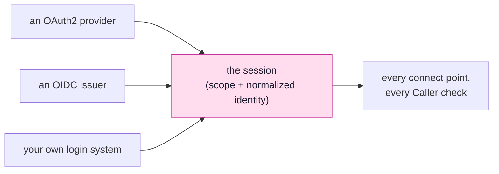
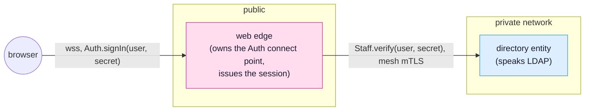

<!-- SPDX-FileCopyrightText: 2026 Alexandre 'kidev' Poumaroux -->
<!-- SPDX-License-Identifier: Apache-2.0 -->

# An identity service of your own

The first two pages of this track each implemented an interface. This one does not,
because there is no `IIdentityProvider` to implement, and the reason for that absence is
the most useful thing on this page.

A database provider is swappable because every relational engine answers the same
question: here is a statement and its parameters, give me rows. Authentication has no such
question. What varies between two login systems is not how they answer, it is what the
browser is made to do, what is signed, what is verified, and what the resulting claim
means. Freezing that behind one interface would mean either an interface so wide it
guarantees nothing, or one so narrow it fits only what its author had in mind.

So SynQt puts the seam somewhere else. It is not at the login system. It is at the
session: a bounded, revocable, server-held record carrying a scope and a normalized
identity. Everything upstream of that record is negotiable. Nothing downstream of it is,
which is why a connect point's `scope:` and a slot's `Caller.hasScope()` work identically
whoever signed the user in.



Customizing identity therefore means answering one question: how far up that diagram do
you have to go? There are three levels, and most systems that believe they need the third
one actually need the first.

## Level 1: A provider SynQt has no template for

If your login system speaks OAuth2 or OpenID Connect, and almost every corporate one does,
then you are not writing code. You are writing down its endpoints.

`synqt add auth <name>` scaffolds a generic OpenID Connect block for any issuer, and you
fill in what its discovery document says:

```yaml
identity:
  enabled: true
  providers:
    - name: staffsso
      authorize_url: https://sso.internal.example/oauth2/authorize
      token_url: https://sso.internal.example/oauth2/token
      jwks_url: https://sso.internal.example/.well-known/jwks.json
      issuer: https://sso.internal.example
      audience: synqt-app                 # defaults to client_id when omitted
      use_id_token: true                  # identity comes from the verified ID token
      scopes: [openid, email, profile]
      client_id: synqt-app
      client_secret: env:STAFFSSO_SECRET  # edge .env only, never synqt.yaml
```

`use_id_token: true` is the one to notice. With it, the identity is taken from the ID
token, whose signature is verified against the issuer's JWKS before a single claim is
read; the issuer and audience are checked too. Without it, identity comes from a userinfo
endpoint and you must say which raw field feeds each normalized one:

```yaml
      userinfo_url: https://sso.internal.example/oauth2/userinfo
      sub_field: employee_id              # stable, and never an email
      login_field: username
      name_field: display_name
      email_field: mail
```

`sub_field` deserves a moment. It becomes `identity.sub`, which is what durable data is
keyed on, so it has to be the identifier that survives a rename, a marriage, a department
transfer, and a change of email address. If the only stable thing your provider returns is
an opaque number, that is the right answer and the friendly one is not.

The whole flow, PKCE, the state parameter, the token exchange, the httpOnly cookie, is
unchanged, and none of it became your problem by using an unusual provider. See
[authentication](authentication.md) for what it does in full.

## Level 2: Your own rules about who someone is

The provider says who signed in. It does not say what they may do here, and it should not:
a scope is your system's word, not theirs. That translation is the mapping hook, and it is
where most real customization lives.

`web/identity/map.qml`:

```qml
import QtQuick
import SynQt

IdentityMapping {
    // Roles live in the staff directory, not in this file, so granting someone moderator
    // is a change to data rather than a deploy. `assignments` is a pushed property on a
    // connect point the edge consumes: the directory owns it, the edge already holds the
    // current value, and reading it here costs nothing.
    function scopeFor(identity) {
        const role = Directory.roles.assignments[identity.sub] ?? "";
        if (role === "owner") {
            return "admin";
        }
        if (role === "support") {
            return "moderator";
        }
        // Authenticated, and nothing more. A provider saying who someone is has never
        // been the same as this system saying what they may do.
        return "user";
    }
}
```

Three things about this hook are worth stating plainly.

It runs on the edge, after a successful login, and nowhere else. Nothing in it is
reachable from a browser, and the value it returns is written into a server-held session
record the browser only ever sees as an opaque cookie.

It is synchronous, and that constrains how it reaches data. The edge needs a scope
before it can create the session, so `scopeFor` returns a value rather than waiting for
one, which means a slot call over the mesh is no use here: a returning slot gives you a
promise, and a promise is not a scope. A pushed `prop` is the shape that works, because a
consumer holds the current value locally and reading it does not go anywhere. Declare the
role table as `prop var assignments` on the directory's connect point and let the
directory replace it whenever it changes; the edge's copy is current, and the hook is a
lookup. If a scope genuinely cannot be derived without a round trip, do the round trip in
the slot that needs it and raise the session with `Caller.setScope()` there instead.

It must tolerate a missing field. `identity.email` is nullable, deliberately: a provider
may simply not give you one. A hook that keys authorization on an email is a hook that
grants the wrong scope on the day someone signs up without one.

## Level 3: A login system that is not OAuth2 at all

Now the interesting case: a staff directory that authenticates a username and password
over LDAP, a hardware token service, a legacy ticket system. No authorization endpoint, no
ID token, nothing to configure.

The move is not to extend the identity system. It is to notice that this is an ordinary
entity problem, and that SynQt already has an answer for those. Build the login system as
an entity, give it a connect point, and let the edge consume it. What that entity does
inside itself is not the framework's business, exactly as a database entity's engine is
not.



The contract the browser sees carries no secrets and no roles:

```syn
contract Auth {
    prop bool ready
    slot signIn(string username, string secret)
    signal signedIn()
    signal refused(string reason)
}
```

`signIn` returns nothing and answers with a signal, because verifying a credential means
a mesh call and a mesh call is a promise. The auction taught this shape already: a
consumer asks, and the owner answers when it has an answer.

The directory entity's own contract is the one that touches LDAP, and only the edge is on
its consumer list:

```syn
contract Staff {
    slot verify(string username, string secret): var
}
```

The edge's Source is where the session is actually issued:

```qml
import QtQuick
import SynQt

AuthSource {
    id: auth

    ready: true

    function signIn(username, secret) {
        // The credential goes straight to the entity that can check it, and nowhere
        // else. It is not stored, not logged, and not put on a property: the only thing
        // that outlives this call is the session.
        Directory.staff.verify(username, secret).then(person => {
            if (!person.ok) {
                // One message for a bad username and a bad password alike. Two messages
                // is an account enumeration feature.
                Caller.emitRefused("Sign in failed.");
                return;
            }
            // This is the seam. Whatever happened above, the system's state afterwards
            // is a session with a scope and a normalized identity, exactly as an OAuth2
            // login would have left it, so every connect point and every Caller check
            // behaves the same from here.
            Caller.setScope(person.role === "support" ? "moderator" : "user",
                            { sub: person.employeeId, login: username,
                              name: person.displayName, email: person.email });
            Caller.emitSignedIn();
        });
    }
}
```

`Caller.setScope()` rotates the session id as it raises the scope, which is what closes
session fixation: a token someone held before signing in is not the token they hold after.

Four rules apply to this shape, and none of them is new. They are the same rules the rest
of SynQt already runs on.

The check is on the owner. `signIn` is a slot on the edge, so its body runs on the
edge. A client cannot call `setScope` and cannot reach `Directory.staff` at all: the
directory's consumer list has one entry on it, and that entry is the edge.

The identity is normalized. Fill `sub`, `login`, `name`, and `email`, because that is
what every hook, every slot, and every example reads. `sub` is the stable one: an employee
number, not a username somebody will change.

The credential is not data. It arrives as a slot argument, is passed to the one entity
that can verify it, and is never written anywhere. Not a property, not a model, not a log
line, not a cache key.

Rate limiting is yours here. An OAuth2 provider was absorbing brute force attempts on
your behalf; a `signIn` slot is not. Count failures per session and per address on the
edge and refuse past a threshold, in the same slot, before the mesh call.

> [!IMPORTANT]
> A password crossing a slot is a password crossing the wire, so this shape is only
> acceptable over the `wss` link SynQt already requires, to an edge that is the one
> entity facing the internet. That is the default, and it is not a place to make an
> exception for a development convenience: `synqt dev` issues real certificates so you
> do not have to.

## Where identity runs

One line moves all of this off the edge and into an entity of its own:

```yaml
identity:
  provider_entity: auth
```

The auth entity then owns the identity and session connect points and every edge consumes
them over the mesh. Tokens and secrets end up in one internal service instead of in each
edge, and sessions become common to all of them. Nothing user facing changes, and no QML
changes, because the edge was already reaching identity through a connect point boundary.
This is worth doing when you have more than one edge, and not before.

## Try it, then think

> [!QUESTION]
> A colleague proposes skipping the edge: let the client call `Directory.staff.verify()`
> itself and set its own scope from the answer, saving a hop. Two things make that
> impossible rather than merely unwise. What are they?

<details class="solution" markdown>
<summary>Solution</summary>

The first is topology. Adding `client` to the `staff` connect point's consumer list fails
`synqt check`, because a connect point a client consumes must be owned by a web edge, and
the directory is not one. There is no configuration in which a browser reaches that entity,
so the hop that was going to be saved does not exist.

The second is that a scope is not something a caller holds. It is a field on a session
record kept on the server, set by owner-side code and read by owner-side checks. A client
that decided its own scope would be editing a copy: the session the edge consults would be
unchanged, and every scoped connect point would go on refusing it. There is no client-side
representation of authorization to corrupt, which is why the attack does not have a
smaller version that works.

Both are the same design showing up twice: the browser is a consumer, and a consumer asks.

</details>

## What you learned

- Identity has no provider interface on purpose. The swappable thing in SynQt is the
  session, not the login system, because that is the boundary every other rule is written
  against.
- Most custom authentication is configuration: an OIDC issuer's endpoints, and
  `use_id_token: true` so claims are verified against its JWKS before they are read.
- `sub_field` picks the identifier your data is keyed on forever. Choose the stable one,
  not the readable one.
- The mapping hook is where your rules live, it runs only on the edge, it may consult a
  connect point so roles are data, and it must survive a null email.
- A login system that is not OAuth2 is an ordinary entity with an ordinary connect point,
  and the seam it plugs into is `Caller.setScope()`, which rotates the session as it
  raises it.
- What you inherit either way: the credential never becomes data, the check runs on the
  owner, and the browser reaches exactly one entity.

That is the whole of the seam. Back to [the overview](tutorial-advanced.md), or on to
[providers](providers.md) for the reference behind the two interfaces this track
implemented.
