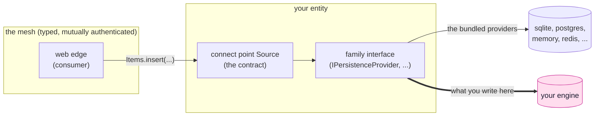

<!-- SPDX-FileCopyrightText: 2026 Alexandre 'kidev' Poumaroux -->
<!-- SPDX-License-Identifier: Apache-2.0 -->

# Adaptors of your own

The other tutorials build apps. This one builds the pieces underneath one, for the day
your system has to reach something SynQt has never heard of: an in house key value
store, a warehouse database three teams already depend on, the single sign on service
your company will not be replacing for you.

There is exactly one seam in SynQt for that, and it is deliberately narrow. An entity
has two faces. Inward, it is a connect point: a typed contract, carried over the
authenticated mesh, authorized in every slot. Outward, it is a provider: the one part
of the entity that knows what the data is actually stored in. Consumers see only the
first face, so the second can be anything, including something you wrote yourself.

An adaptor is that lower box: a class implementing one family interface, registered
under a name, selected by one line of configuration. Nothing above it changes. The same
`Items.qml` that ran against SQLite runs against your engine, with the same `Caller`
checks, the same deny by default topology, and the same guarantee that no consumer can
reach past the entity to the engine behind it.

## What you will learn

- Where the seam is, and why it is the only one: what a provider may decide, and what it
  is never allowed to decide.
- How to implement a family interface end to end, in the two shapes real engines come
  in: one that speaks SQL through a Qt driver, and one that speaks its own protocol over
  a socket.
- How to register an adaptor so `provider.name: custom:YourEngine` finds it, why
  `custom:` is a namespace rather than decoration, and what happens when a name selects
  nothing.
- How to honor the contract every provider is held to: parameters passed separately,
  errors returned rather than thrown, credentials from the entity environment only, and
  a verified connection or none at all.
- What to do when your engine does not fit the interface. Some engines have no
  transactions, some have no TLS, some cannot count atomically. Each of those has a
  right answer, and it is never to pretend.
- Why identity is not a provider, and what the equivalent seam looks like for an
  authentication service that is not an OAuth2 provider off the shelf.

## Before you start

Do [the auction](tutorial.md) first, at least through
[a permanent Hall of Fame](tutorial-hall-of-fame.md), so an entity with a database
behind it is familiar rather than new. Read [providers](providers.md) for the
shape of the system you are extending. This track is C++ where the others were QML,
so you want to be comfortable reading a class; you do not need to be a Qt expert, and
every Qt type used here is linked to its documentation.

You do not need a project of your own to follow along. Each page is a complete adaptor
you could paste into an entity, and you can read them without running anything. If you
do want to run one, any project from an earlier tutorial with a database entity in it
will do.

## The three parts

1. [A database of your own](tutorial-advanced-database.md): the persistence family, end
   to end, against Microsoft SQL Server through Qt's ODBC driver. Connection, verified
   TLS, parameterized statements, transactions, and forward only migrations.
2. [A cache of your own](tutorial-advanced-cache.md): the cache family, against
   Memcached, which Qt has no driver for at all. A wire protocol written by hand, and
   what to do about an engine whose `incr` refuses to create a counter.
3. [An identity service of your own](tutorial-advanced-identity.md): why authentication
   has no provider interface, the three levels of customization it has instead, and how
   to put a login system SynQt has never seen behind the same session and scope model.

> [!NOTE]
> The reference behind all three is [providers](providers.md) for the families and the
> selection syntax, [entities](entities.md) for what an entity is allowed to be,
> [authentication](authentication.md) for the identity model, and
> [security](security.md) for the rules an adaptor inherits rather than chooses.
