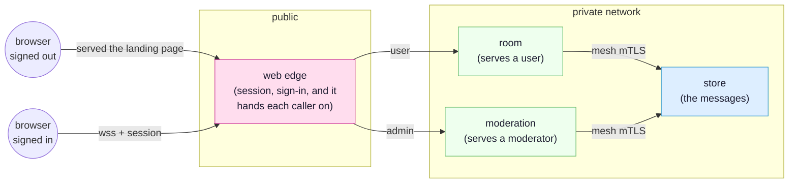

<!-- SPDX-FileCopyrightText: 2026 Alexandre 'kidev' Poumaroux -->
<!-- SPDX-License-Identifier: Apache-2.0 -->

# The simple chat

Somebody types a line, and it appears in every window that has the room open, including the
ones on other machines. Nothing polls, nobody writes a broadcast, and the live part of it is
one binding.

It is the first tutorial to do because it is the whole model in miniature: an owner that
decides, consumers that ask, a contract that says what may cross, and a database the browser
has no way to reach. It then does the two things that turn that into a system rather than a
demo -- deciding who is served which application, and deciding who answers them once they
are in -- because those are the two decisions every real application makes and the two that
are painful to add afterwards.

## What you will build

A chat room. A visitor who has signed in as nobody gets a landing page; everybody else gets
the room. A moderator can erase a message and their own name shows in red, and neither of
those is a check written in the client.



The finished app is
[`examples/chat`](https://github.com/Kidev/SynQt/tree/main/examples/chat), so you can read
the whole thing at any point, or run it if a step goes sideways. It is also the project the
[front page](index.md) reads out file by file.

**[Open it in the designer](/designer/#example=demo)** to see the finished shape before you
build it: the six entities, the lines between them, and beside each line the contract that
crosses it. Nothing is installed, and pulling it apart there changes nothing on your disk.

## What you will learn

- The four kinds of thing a contract can carry, one of each: a property the owner pushes, a
  model every consumer mirrors, a slot a consumer calls, and a signal the owner sends back.
- Why a model is the whole of the synchronisation: reassign the rows on the owner and every
  browser holding the room redraws itself.
- What `Caller` is, and why the check that decides whether somebody may speak lives behind
  the edge and not in the browser that asked.
- What a delivery gate is: two client bundles on one edge, so a signed-out visitor is not
  shown a locked door, they are served a different application.
- What a front is: an edge that owns a connect point it does not implement, and hands each
  caller to the entity that serves people of their scope. It is how a privileged surface
  ends up in a binary the process serving everybody else does not contain.
- Why a column in the table that is not in the contract never leaves the mesh.

## Before you start

Install the toolchain if you have not: [quick start](quick-start.md) takes about a minute.
Then create the project:

```cli
synqt new chat --auth github
```

`--auth github` primes the sign-in flow, which this tutorial needs: the room is behind a
scope, and a scope comes from signing in. It writes the `identity:` block, the mapping hook
at `web/edge/identity/map.qml`, and a `.env.example`. Register an OAuth app with GitHub, put
its client id in `synqt.yaml` and its secret in `.env`, and see
[authentication](authentication.md) if any of that is unfamiliar.

```cli
cd chat
synqt add entity store --type relational
synqt add entity room --type cache
synqt add entity moderation --type service
synqt dev
```

> [!IMPORTANT]
> Keep `synqt dev` running in this terminal for the whole tutorial. It watches your files,
> rebuilds what changed, and issues the development mesh certificates so the entities can
> talk to each other over mutual TLS with nothing for you to set up.

## Step 1: say what crosses

Open `synqt.yaml`. A connect point is owned by one entity, listed for the entities that may
consume it, and its `export:` block is the whole of what crosses it. Start with the one the
browser reaches:

```yaml
connect_points:
  - owner: edge
    consumers: [app]
    scope: user
    export: |
      prop string[60] topic
      model messages(int id, string[40] who, string[280] body, bool staff)
      slot say(string[280] body)
      <admin> slot erase(int id)
      signal refused(string[120] reason)
```

That is one of each kind:

- `prop topic` is owner to consumers, pushed. A consumer can read it and can never set it.
- `model messages` is the room. The four roles listed are the whole of what a message may
  carry to a browser.
- `slot say` is the one direction a request travels, and `string[280]` is a limit the owner
  holds callers to at the boundary rather than a hint to the field that typed it.
- `<admin> slot erase` is the same, with a gate on the member. A caller without that scope
  does not have the slot: it is refused before it runs, so there is no check to write, and
  to forget, in the QML behind it.
- `signal refused` is what the owner says back when it says no, and it goes to the caller
  that asked and to nobody else in the room.

`scope: user` is the gate on the whole point. A session that has signed in as nobody never
acquires it at all, so there is no surface for them to reach and nothing for them to call.

## Step 2: hand each caller on

The edge could implement all of that itself, and for a smaller system it should. This one
does something else, because of what `erase` is: a privileged action, and the safest place
for the code behind a privileged action is a process that ordinary callers never reach.

Add a `behind:` block to the point you just wrote:

```yaml
    behind:
      user: room
      admin: moderation
```

That makes the edge a **front**. It stops answering its own connect point: it keeps what
only it can keep, the session and the sign-in, and each caller is served by the entity wired
to their scope. The browser goes on writing `Server` whichever one answered, and has no way
to find out which did.

`anonymous` is wired to nothing, which is the right answer rather than an omission: the
point is gated `scope: user`, so there is nobody of that scope to serve.

Now say what each of those two entities offers, which is the same list split in one place:

```yaml
  - owner: room
    consumers: [edge]
    export: |
      prop string[60] topic
      model messages(int id, string[40] who, string[280] body, bool staff)
      slot say(string[280] body)
      signal refused(string[120] reason)

  - owner: moderation
    consumers: [edge]
    export: |
      prop string[60] topic
      model messages(int id, string[40] who, string[280] body, bool staff)
      slot say(string[280] body)
      slot erase(int id)
      signal refused(string[120] reason)
```

`room` has no `erase` on it. That is the whole of why an ordinary user cannot erase a
message: not a check somebody wrote, but a member that is not on the surface they acquired.
`synqt check` holds each entity behind a front to exactly what the front offers its callers,
so the day somebody widens one of these lists is the day the build stops.

Neither of them holds the room. Add the point the database owns:

```yaml
  - owner: store
    consumers: [room, moderation]
    export: |
      prop string[60] topic
      prop var[24000] lines
      slot say(string[40] who, string[280] body, bool staff)
      slot erase(int id)
```

Two surfaces, one conversation. The browser is on no consumer list anywhere in this file,
which is the whole of why a tab cannot reach the database: not a firewall rule, a list.

## Step 3: the log

Open `db/relational/store/Store.qml`. The type is the entity's own name capitalised.

```qml
import SynQt

// The conversation, and the only thing here that survives a restart. Nothing in this file
// asks who is calling: this point lists two consumers, so those two entities are the only
// ones that can acquire it at all, and a browser is on no consumer list anywhere.
Store {
    id: log

    function say(who, body, staff) {
        Db.exec("INSERT INTO messages (who, body, staff, said_at) "
                + "VALUES (?, ?, ?, datetime('now'))",
                [who, body, staff ? 1 : 0]);
        log.refresh();
    }

    function erase(id) {
        Db.exec("DELETE FROM messages WHERE id = ?", [id]);
        log.refresh();
    }

    // The room as it stands, reassigned in one go. Every surface in front of this mirrors
    // the property, so one line typed anywhere redraws every window open on the room and
    // nobody wrote a broadcast.
    //
    // `said_at` is in the table and not in the SELECT, and not in the contract either. A
    // column the browser is never told about is a column it cannot receive: the boundary
    // keeps the declared roles and drops the rest, so it could not cross even by accident.
    function refresh() {
        const rows = Db.query("SELECT id, who, body, staff FROM messages "
                              + "ORDER BY id DESC LIMIT 50");
        log.lines = rows.map(row => ({ id: row.id, who: row.who, body: row.body,
                                       staff: row.staff !== 0 }));
    }

    topic: "Anything goes"
    lines: []

    Component.onCompleted: log.refresh()
}
```

Every value goes in as a parameter, never as a piece of a string. That is what makes an
injection attempt inert: the driver is handed a query and a list of values, and a value is
never parsed as SQL.

`log.lines` is reassigned in one go, and that reassignment is the synchronisation. Both
surfaces in front of this mirror the property; every browser holding the room mirrors what
they publish. There is no `emit`, no subscriber list, and nothing to remember to call.

And `db/relational/store/schema.sql`:

```sql
CREATE TABLE IF NOT EXISTS messages (
    id      INTEGER PRIMARY KEY AUTOINCREMENT,
    who     TEXT NOT NULL,
    body    TEXT NOT NULL,
    staff   INTEGER NOT NULL DEFAULT 0,
    said_at TEXT NOT NULL
);

CREATE INDEX IF NOT EXISTS messages_by_time
    ON messages (said_at);
```

`said_at` is in the table and not in the contract. Look back at `model messages(...)`: four
roles, and that is not one of them. A column the browser is never told about is a column it
never receives, and there is no way to ask for it.

## Step 4: the two surfaces

Open `cache/room/Room.qml`, which is what a signed-in user is handed to:

```qml
import SynQt

// What a signed-in user is handed to. Nothing here asks about scope, and that is not an
// omission: the edge in front of it hands nobody but a `user` here, so `Caller` is the only
// question there is to ask, and the members a moderator reaches are not on this surface for
// anybody to call.
//
// The room itself is not here either. `store` holds it, this mirrors it, and the moderator's
// entity mirrors the same one, which is what makes them two views of one conversation.
Room {
    id: room

    function say(body) {
        const who = Caller.identity.login;
        // How much this person has said in the last minute, kept in the one place worth
        // keeping it: a bounded store that forgets. The window starts when the first message
        // of it lands, so this is a fixed minute rather than a minute from the last thing
        // said, which would never expire for somebody typing steadily.
        const said = Cache.incr("said:" + who);
        if (said === 1) {
            Cache.expire("said:" + who, 60);
        }
        if (said > 20) {
            Caller.emitRefused("Twenty lines a minute is the limit. Give it a moment.");
            return;
        }
        Store.say(who, body, false);
    }

    topic: Store.topic
    messagesRows: Store.lines
}
```

`Caller` is whoever made this request, taken from the session the edge verified and handed
down with the call. A browser cannot read that value, let alone set it.

Nothing here asks about scope, and that is not an omission: the edge in front of it hands
nobody but a `user` here, so `Caller` is the only question there is to ask.

`Cache` is why this entity is a cache: a rate counter is expensive to keep in a database,
cheap to lose, and worth nothing after a minute, which is the whole description of what a
bounded store that forgets is for.

Now `service/moderation/Moderation.qml`:

```qml
import SynQt

// What a moderator is handed to, in a binary of its own. `erase` is compiled into this
// entity and into nothing else, and neither is the line below that marks a message as staff:
// the process serving ordinary users does not contain either of them.
//
// Like the entity next door, it never asks about scope. The edge decides who arrives here.
Moderation {
    id: desk

    // A moderator is not rate limited, which is why this entity has no cache and the one
    // serving users does. What is different about the two surfaces is what each of them
    // holds, not a flag either of them reads.
    function say(body) {
        Store.say(Caller.identity.login, body, true);
    }

    // Read against the room as it stands rather than against a query of its own: the caller
    // is looking at these rows, so this is the question they think they are asking. The
    // answer goes back to the one caller who asked it and to nobody else in the room.
    function erase(id) {
        if (!Store.lines.some(line => line.id === id)) {
            Caller.emitRefused("That message is not in the room any more.");
            return;
        }
        Store.erase(id);
    }

    topic: Store.topic
    messagesRows: Store.lines
}
```

The `true` in `say` is what marks a message as staff, and it is the reason a moderator's
name is about to show in red. There is no argument for it on the browser-facing contract and
no way for a client to set it: this line is compiled into this entity and into no other, and
the process serving ordinary users does not contain it.

## Step 5: the room's window

Open `client/app/Main.qml`:

```qml
import SynQt
import QtQuick.Controls
import QtQuick.Layouts

ApplicationWindow {
    id: window

    property string notice: ""

    visible: true
    title: Server.topic

    Edge.onRefused: reason => window.notice = reason

    ColumnLayout {
        anchors.fill: parent

        ListView {
            id: messages

            Layout.fillHeight: true
            Layout.fillWidth: true
            clip: true
            model: Server.messages

            delegate: Item {
                id: line

                required property var model

                width: messages.width
                height: 26

                Label {
                    x: 8
                    width: 132
                    height: parent.height
                    verticalAlignment: Text.AlignVCenter
                    elide: Text.ElideRight
                    color: line.model.staff ? "#d0342c" : window.palette.windowText
                    font.bold: line.model.staff
                    text: line.model.who
                }

                Label {
                    x: 148
                    width: parent.width - 148 - 88
                    height: parent.height
                    verticalAlignment: Text.AlignVCenter
                    elide: Text.ElideRight
                    text: line.model.body
                }

                Button {
                    x: parent.width - 84
                    y: 1
                    width: 76
                    height: parent.height - 2
                    visible: Session.hasScope("admin")
                    text: qsTr("Erase")
                    onClicked: Server.erase(line.model.id)
                }
            }
        }

        TextField {
            id: draft

            Layout.fillWidth: true
            placeholderText: window.notice || qsTr("Say something")
            onAccepted: {
                Server.say(draft.text);
                window.notice = "";
                draft.clear();
            }
        }
    }
}
```

`Server` is the client's name for its edge, and it means the same thing whichever entity
behind the front answered. `Server.topic` is the pushed property, read-only here and live.
`Server.messages` is the model, handed straight to a `ListView`. `Edge.onRefused` is the
contract's signal, handled where it arrives, with no `Connections` block and no target to
wire up.

The delegate reads its row through `required property var model` rather than a property per
role, because one of the roles is called `id`, and `id` is a QML keyword.

`Session.hasScope("admin")` on the button is a courtesy and not a gate. What stops everybody
else is that `erase` is not a member of the surface their session acquired, so there is
nothing for them to call whatever this file says.

## Step 6: the landing page

A signed-out visitor never acquires the room's point, so the room's window would come up
with nothing in it. Serve them a different application instead.

Create `client/home/Main.qml`:

```qml
import SynQt
import QtQuick.Controls
import QtQuick.Layouts

ApplicationWindow {
    id: window

    visible: true
    title: qsTr("The chat room")

    ColumnLayout {
        anchors.centerIn: parent
        spacing: 24

        Label {
            Layout.alignment: Qt.AlignHCenter
            font.pixelSize: 32
            text: qsTr("One room. Everybody in it sees the same thing.")
        }

        Button {
            Layout.alignment: Qt.AlignHCenter
            text: qsTr("Sign in with GitHub")
            onClicked: Session.login()
        }
    }
}
```

Then declare it in `synqt.yaml`, and tell the edge who gets which bundle:

```yaml
entities:
  - { name: home, type: client, targets: [wasm] }
  - { name: app, type: client, targets: [wasm] }
  - name: edge
    type: web_edge
    identity: true
    bundles:
      anonymous: home
      user: app
```

`bundles:` is delivery, not navigation. A session without `user` is served `home` and cannot
fetch a file of `app` at all: not a redirect, not a 403, simply not there. The room's client
is not on a signed-out visitor's disk to be read, reverse engineered, or pointed at.

`admin` has no line of its own, because scopes rank here: a moderator is served the nearest
bundle at or below what they hold, which is the room. One client, two kinds of person, and
the difference between them decided behind the edge.

Last, say who is a moderator. Open `web/edge/identity/map.qml`, which is the one place in
the project that decides:

```qml
import SynQt

IdentityMapping {
    id: mapping

    readonly property var moderators: ["octocat"]

    function scopeFor(identity) {
        return mapping.moderators.indexOf(identity.login) >= 0 ? "admin" : "user";
    }
}
```

Put your own GitHub login in that list, sign in, and your name in the room turns red.

## Three things to try

Each one takes a minute and each one shows a boundary rather than describing it.

**A line that is too long.** Open the browser's console on the room and call
`Server.say("x".repeat(500))`. The contract says `string[280]`, and the owner-side boundary
refuses the value rather than truncating it into something that looks fine. Nothing reaches
the table.

**Erasing as an ordinary user.** Sign in as somebody who is not in that `moderators` list,
open the console, and call `Server.erase(1)`. There is no such function. The session was
handed to `room`, whose surface has no `erase` on it, so this is not a call that was
refused: it is a call there was never anything to make.

**The browser reaching the database.** Add `app` to the `store` point's consumers:

```yaml
  - owner: store
    consumers: [room, moderation, app]
```

Then run:

```cli
synqt check
```

It fails. A connect point a browser consumes must be owned by a web edge, because a browser
can physically reach nothing else. Take `app` off the list again before carrying on.

## Where to go next

- [The auction](tutorial.md) is the next tutorial: the same shape with a rule the owner
  enforces, real sign-in with scopes that differ, and a permanent Hall of Fame.
- [Programming model](programming-model.md) is the reference behind everything above:
  connect points, contracts, `Caller`, `behind:`, and what each kind of member means.
- [Security](security.md) covers the two identity systems, the delivery gate, and why the
  database is unreachable from the browser and from the internet.
- [The visual editor](visual-editor.md) is the drawing board this tutorial linked to at the
  top. Open the chat there, add an entity, and export the result as a project.
