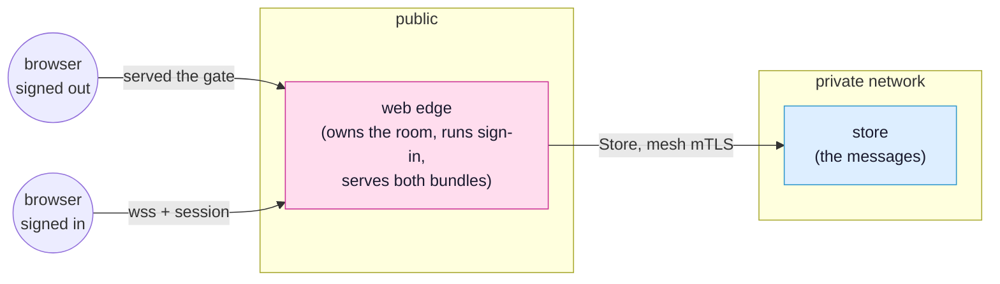

<!-- SPDX-FileCopyrightText: 2026 Alexandre 'kidev' Poumaroux -->
<!-- SPDX-License-Identifier: Apache-2.0 -->

# The simple chat

The shortest complete SynQt system there is. Somebody types a line, and it appears in every
window that has the room open, including the ones on other machines. Nothing polls, nobody
writes a broadcast, and the whole thing is one configuration file and four short QML files.

It is the first tutorial to do because it is the whole model in miniature: an owner that
decides, consumers that ask, a contract that says what may cross, and a database the
browser has no way to reach. Everything after this is the same four ideas with more nouns.

## What you will build

A chat room called the chat. Two client bundles, a web edge that owns the room, and a
database that keeps the messages.



The finished app is
[`examples/chat`](https://github.com/Kidev/SynQt/tree/main/examples/chat), so you can read
the whole thing at any point, or run it if a step goes sideways. It is also the project the
[front page](index.md) reads out file by file.

**[Open it in the designer](/designer/#example=demo)** to see the finished shape before you
build it: the four entities, the two links, and beside each line the contract that crosses
it. Nothing is installed, and pulling it apart there changes nothing on your disk.

## What you will learn

- The four kinds of thing a contract can carry, one of each: a property the owner pushes, a
  model every consumer mirrors, a slot a consumer calls, and a signal the owner sends back.
- Why a model is the whole of the synchronisation: reassign the rows on the owner and every
  browser holding the room redraws itself.
- What `Caller` is, and why the check that decides whether somebody may speak lives on the
  edge and not in the browser that asked.
- What a delivery gate is: two client bundles on one edge, so a signed-out visitor is not
  shown a locked door, they are served a different application.
- Why a column in the table that is not in the contract never leaves the mesh.

## Before you start

Install the toolchain if you have not: [quick start](quick-start.md) takes about a minute.
Then create the project and leave it running:

```cli
synqt new chat --auth github
```

`--auth github` primes the sign-in flow, which this tutorial needs: the room is behind a
scope, and a scope comes from signing in. It writes the `identity:` block, the mapping hook
at `web/edge/identity/map.qml`, and a `.env.example`. Register an OAuth app with GitHub, put
its client id in `synqt.yaml` and its secret in `.env`, and see
[authentication](authentication.md) if any of that is unfamiliar.

```cli
cd chat
synqt add entity store --type relational
synqt dev
```

> [!IMPORTANT]
> Keep `synqt dev` running in this terminal for the whole tutorial. It watches your files,
> rebuilds what changed, and issues the development mesh certificates so the edge and the
> database can talk to each other over mutual TLS with nothing for you to set up.

## Step 1: say what crosses

Open `synqt.yaml`. A connect point is owned by one entity, listed for the entities that may
consume it, and its `export:` block is the whole of what crosses it. Replace the
`connect_points:` section with these two:

```yaml
connect_points:
  - owner: edge
    consumers: [app]
    export: |
      prop string[60] topic
      model messages(int id, string[40] who, string[280] body)
      slot say(string[280] body)
      signal refused(string[120] reason)

  - owner: store
    consumers: [edge]
    export: |
      slot var recent()
      slot var append(string[40] who, string[280] body)
```

That is one of each kind on the first point:

- `prop topic` is owner to consumers, pushed. The edge sets it; every window retitles
  itself. A consumer can read it and can never set it.
- `model messages` is the room. The three roles listed are the whole of what a message may
  carry to a browser.
- `slot say` is the one direction a request travels, and `string[280]` is a limit the owner
  holds callers to at the boundary rather than a hint to the field that typed it.
- `signal refused` is what the edge says back when it says no, and it goes to the caller
  that asked and to nobody else in the room.

The second point is the database's, and the browser is on no consumer list anywhere in this
file. That is the whole of why a tab cannot reach it: not a firewall rule, a list.

## Step 2: the room

Open `web/edge/Edge.qml`. The type is the entity's own name capitalised, and there is one of
it, because there is one of this entity.

```qml
import SynQt

Edge {
    id: room

    property var said: []

    function say(body) {
        if (!Caller.hasScope("user")) {
            Caller.emitRefused("Sign in to say something.");
            return;
        }
        Store.append(Caller.identity.login, body).then(rows => room.said = rows);
    }

    topic: "Anything goes"
    messagesRows: room.said

    Component.onCompleted: Store.recent().then(rows => room.said = rows)
}
```

Four lines are doing the work.

`Caller` is whoever made this request, decided by the edge from the session it holds. A
browser cannot read that value, let alone set it, so `hasScope` is a question with an
answer the caller cannot influence.

`Store` is the database's connect point, by the owner's name capitalised. `append` returns a
value, so the call answers a promise and the edge waits on it without blocking anything else
it is serving.

`messagesRows: room.said` is the synchronisation, and it is one binding. Every change to
`said` republishes the model, and every browser holding the room redraws. There is no
`emit`, no subscriber list, and nothing to remember to call.

## Step 3: the log

Open `db/relational/store/Store.qml`:

```qml
import SynQt

Store {
    id: log

    function recent() {
        return Db.query(
            "SELECT id, who, body FROM messages ORDER BY id DESC LIMIT 50");
    }

    function append(who, body) {
        Db.exec("INSERT INTO messages (who, body, said_at) VALUES (?, ?, datetime('now'))",
                [who, body]);
        return log.recent();
    }
}
```

Nothing here asks who is calling. It does not have to: this point lists one consumer, so the
edge is the only entity that can acquire it at all.

Every value goes in as a parameter, never as a piece of a string. That is what makes an
injection attempt inert: the driver is handed a query and a list of values, and a value is
never parsed as SQL.

And `db/relational/store/schema.sql`:

```sql
CREATE TABLE IF NOT EXISTS messages (
    id      INTEGER PRIMARY KEY AUTOINCREMENT,
    who     TEXT NOT NULL,
    body    TEXT NOT NULL,
    said_at TEXT NOT NULL
);

CREATE INDEX IF NOT EXISTS messages_by_time
    ON messages (said_at);
```

`said_at` is in the table and not in the contract. Look back at `model messages(...)`: three
roles, and that is not one of them. A column the browser is never told about is a column it
never receives, and there is no way to ask for it.

## Step 4: the room's window

Open `client/app/Main.qml`:

```qml
import SynQt
import QtQuick
import QtQuick.Controls
import QtQuick.Layouts

ApplicationWindow {
    id: window

    property string notice: ""

    visible: true
    title: Server.topic

    Edge.onRefused: reason => window.notice = reason

    ColumnLayout {
        anchors.fill: parent

        ListView {
            Layout.fillHeight: true
            Layout.fillWidth: true
            model: Server.messages

            delegate: Text {
                required property var model

                text: `${model.who}: ${model.body}`
            }
        }

        TextField {
            id: line

            Layout.fillWidth: true
            placeholderText: window.notice || qsTr("Say something")
            onAccepted: {
                Server.say(line.text);
                line.clear();
            }
        }
    }
}
```

`Server` is the client's name for its edge. `Server.topic` is the pushed property, read-only
here and live. `Server.messages` is the model, handed straight to a `ListView`.
`Edge.onRefused` is the contract's signal, handled where it arrives, with no `Connections`
block and no target to wire up.

## Step 5: the gate

A signed-out visitor has no `user` scope, so `say` would refuse them. Refusing is the right
answer and it is a poor experience: they are looking at a room they cannot use.

Give them a different application instead. Create `client/gate/Main.qml`:

```qml
import SynQt
import QtQuick
import QtQuick.Controls

ApplicationWindow {
    id: window

    visible: true
    title: qsTr("Sign in")

    Column {
        anchors.centerIn: parent
        spacing: 16

        Label {
            text: qsTr("Sign in to join the room.")
        }

        Button {
            text: qsTr("Sign in")
            onClicked: Session.login()
        }
    }
}
```

Then declare it in `synqt.yaml`, and tell the edge who gets which bundle:

```yaml
entities:
  - { name: gate, type: client, targets: [wasm] }
  - { name: app, type: client, targets: [wasm] }
  - name: edge
    type: web_edge
    identity: true
    bundles:
      anonymous: gate
      user: app
  - { name: store, type: relational, provider: { name: sqlite } }
```

`bundles:` is delivery, not navigation. A session without `user` is served `gate` and cannot
fetch a file of `app` at all: not a redirect, not a 403, simply not there. The room's client
is not on a signed-out visitor's disk to be read, reverse engineered, or pointed at.

## Three things to try

Each one takes a minute and each one shows a boundary rather than describing it.

**A line that is too long.** Open the browser's console on the room and call
`Server.say("x".repeat(500))`. The contract says `string[280]`, and the owner-side boundary
refuses the value rather than truncating it into something that looks fine. Nothing reaches
the table.

**Speaking while signed out.** Open the room in a second browser, sign out, and call
`Server.say("hello")` from its console. The `refused` signal comes back and nothing is
written. The check is on the edge, so editing the client changes nothing about the answer.

**The browser reaching the database.** Add `app` to the `store` point's consumers:

```yaml
  - owner: store
    consumers: [edge, app]
```

Then run:

```cli
synqt check
```

It fails. A connect point a browser consumes must be owned by a web edge, because a browser
can physically reach nothing else. Take `app` off the list again before carrying on.

## Where to go next

- [The auction](tutorial.md) is the next tutorial: the same shape with a rule the owner
  enforces, real sign-in with scopes that differ, and a permanent Hall of Fame.
- [Programming model](programming-model.md) is the reference behind everything above:
  connect points, contracts, `Caller`, and what each kind of member means.
- [Security](security.md) covers the two identity systems, the delivery gate, and why the
  database is unreachable from the browser and from the internet.
- [The visual editor](visual-editor.md) is the drawing board this tutorial linked to at the
  top. Open the chat there, add an entity, and export the result as a project.
