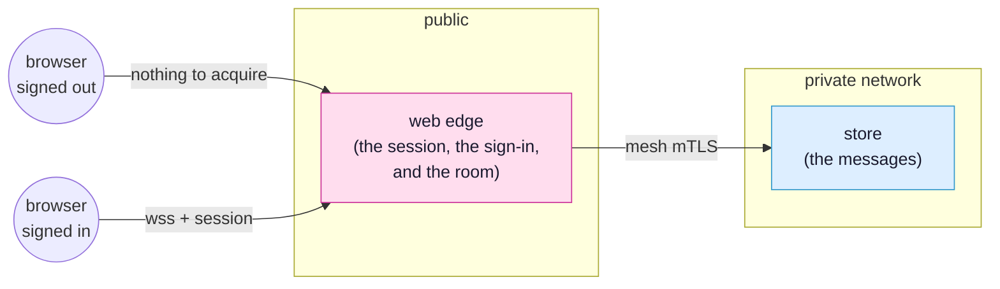

<!-- SPDX-FileCopyrightText: 2026 Alexandre 'kidev' Poumaroux -->
<!-- SPDX-License-Identifier: Apache-2.0 -->

# The simple chat

Somebody types a line, and it appears in every window that has the room open, including the
ones on other machines. Nothing polls, nobody writes a broadcast, and the live part of it is
one binding.

It is the first tutorial to do because it is the whole model in miniature: an owner that
decides, a consumer that asks, a contract that says what may cross, and a database the
browser has no way to reach.

## What you will build

A chat room. A visitor who has signed in as nobody gets a sign-in page; signing in fills the
same window with the room. A moderator can erase a message and their own name shows in red,
and neither of those is a check written in the client.



The finished app is
[`examples/chat`](https://github.com/Kidev/SynQt/tree/main/examples/chat), so you can read
the whole thing at any point, or run it if a step goes sideways. It is also the project the
[front page](index.md) reads out file by file.

**[Open it in the designer](/designer/#example=demo)** to see the finished shape before you
build it: the three entities, the lines between them, and beside each line the contract that
crosses it. Nothing is installed, and pulling it apart there changes nothing on your disk.

## What you will learn

- What a contract carries and what it therefore refuses: a model every consumer mirrors, a
  slot a consumer calls, and a size on every value the owner holds callers to.
- Why a model is the whole of the synchronisation: reassign the rows on the owner and every
  browser holding the room redraws itself.
- What `Caller` is, and why the two facts a message needs besides its text (who said it, and
  whether they said it as staff) are decided on the edge and never sent by the browser.
- The two gates that are not written in the client: a scope on the whole connect point, and
  a scope on one member of it.
- Why a column in the table that is not in the contract never leaves the mesh.

## Before you start

Install the toolchain if you have not: [quick start](quick-start.md) takes about a minute.
Then create the project:

```cli
synqt new chat --auth github
```

`--auth github` marks the edge as the entity that signs people in. This tutorial needs
that: the room is behind a scope, and a scope comes from signing in.

```cli
cd chat
synqt add auth github
synqt add entity store --type relational
synqt dev
```

`synqt add auth` is what writes the flow: the `identity:` block, the mapping hook at
`web/edge/identity/map.qml`, and the `.env.example` entry. It then prints the three things
only you can do. Register an OAuth app with GitHub, put its client id in `synqt.yaml` and
its secret in `web/edge/.env`, and see [authentication](authentication.md) if any of that
is unfamiliar.

> [!IMPORTANT]
> Keep `synqt dev` running in this terminal for the whole tutorial. It watches your files,
> rebuilds what changed, and issues the development mesh certificates so the entities can
> talk to each other over mutual TLS with nothing for you to set up.

## Step 1: say what crosses

Open `synqt.yaml`. A connect point is owned by one entity, listed for the entities that may
consume it, and its `export:` block is the whole of what crosses it. Start with the one the
browser reaches:

```yaml
connect_points:
  - owner: edge
    consumers: [app]
    scope: user
    export: |
      model messages(int id, string[40] who, string[280] body, bool staff)
      slot say(string[280] body)
      <admin> slot erase(int id)
```

Three members, and no more than three:

- `model messages` is the room. The four roles listed are the whole of what a message may
  carry to a browser.
- `slot say` is the one direction a request travels, and `string[280]` is a limit the owner
  holds callers to at the boundary rather than a hint to the field that typed it. The
  browser sends a line of text and nothing else: who said it is not an argument, because it
  is not the browser's to say.
- `<admin> slot erase` is the same, with a gate on the member. A caller without that scope
  does not have the slot: it is refused before it runs, so there is no check to write, and
  to forget, in the QML behind it.

`scope: user` is the gate on the whole point. A session that has signed in as nobody never
acquires it at all, so there is no surface for them to reach and nothing for them to call.

The edge does not hold the room, though. Add the point the database owns:

```yaml
  - owner: store
    consumers: [edge]
    export: |
      prop var[24000] lines
      slot say(string[40] who, string[280] body, bool staff)
      slot erase(int id)
```

`prop lines` is owner to consumers, pushed: the edge can read it and can never set it. The
browser is on no consumer list anywhere in this file, which is the whole of why a tab cannot
reach the database: not a firewall rule, a list.

## Step 2: the log

Open `db/relational/store/Store.qml`. The type is the entity's own name capitalised.

```qml
import SynQt

// The conversation, and the only thing here that survives a restart.
Store {
    id: log

    function say(who, body, staff) {
        Db.exec("INSERT INTO messages (who, body, staff, said_at) "
                + "VALUES (?, ?, ?, datetime('now'))",
                [who, body, staff ? 1 : 0]);
        log.refresh();
    }

    function erase(id) {
        Db.exec("UPDATE messages SET body = 'deleted by a moderator' WHERE id = ?",
                [id]);
        log.refresh();
    }

    // `said_at` is in the table and in neither the SELECT nor the contract, so it
    // never leaves the mesh. Reassigning `lines` is the whole of the synchronisation.
    function refresh() {
        const rows = Db.query("SELECT id, who, body, staff FROM messages "
                              + "ORDER BY id DESC LIMIT 50");
        log.lines = rows.map(row => ({ id: row.id, who: row.who, body: row.body,
                                       staff: row.staff !== 0 }));
    }

    lines: []

    Component.onCompleted: log.refresh()
}
```

Every value goes in as a parameter, never as a piece of a string. That is what makes an
injection attempt inert: the driver is handed a query and a list of values, and a value is
never parsed as SQL.

`log.lines` is reassigned in one go, and that reassignment is the synchronisation. The edge
mirrors the property; every browser holding the room mirrors what the edge publishes. There
is no `emit`, no subscriber list, and nothing to remember to call.

Erasing leaves the line where it was, saying who wrote it and that it is gone. A hole in a
conversation everybody is reading is worse than a marker in it.

And `db/relational/store/schema.sql`:

```sql
CREATE TABLE IF NOT EXISTS messages (
    id      INTEGER PRIMARY KEY AUTOINCREMENT,
    who     TEXT NOT NULL,
    body    TEXT NOT NULL,
    staff   INTEGER NOT NULL DEFAULT 0,
    said_at TEXT NOT NULL
);

CREATE INDEX IF NOT EXISTS messages_by_time
    ON messages (said_at);
```

`said_at` is in the table and not in the contract. Look back at `model messages(...)`: four
roles, and that is not one of them. A column the browser is never told about is a column it
never receives, and there is no way to ask for it.

## Step 3: the edge

The edge owns the point the browser reaches, so it is where every decision about a message
is made. Open `web/edge/Edge.qml`:

```qml
import SynQt

// Everything about a message except its text is decided here.
Edge {
    messagesRows: Store.lines

    function say(body) {
        Store.say(Caller.identity.login, body, Caller.hasScope("admin"));
    }

    function erase(id) {
        Store.erase(id);
    }
}
```

`messagesRows: Store.lines` is the live part. Bind the model once and the room is live in
every window: the database reassigns its list, this mirrors it, every browser redraws.

`Caller` is whoever made this request, taken from the session the edge verified. A browser
cannot read that value, let alone set it, which is why `say` takes a line of text and no
name: the two facts a message needs besides its text are supplied here, from something the
caller cannot reach.

`Caller.hasScope("admin")` is the reason a moderator's name is about to show in red, and the
reason nobody else's can. An ordinary user cannot speak in a moderator's voice by asking to,
because nothing they send arrives at that argument.

`erase` has no check in it, and does not need one: the contract gated the member, so a
caller without `admin` does not have it.

## Step 4: the window

Three files, and the split is only so each one is a page long. Open
`client/app/Main.qml`. One window, and what is in it depends on the session:

```qml
import SynQt
import QtQuick.Controls
import QtQuick.Layouts

// One window, and two things in it: the sign-in a signed-out visitor gets, and the room
// everybody else does. Neither is a page and neither is a route, because the room's connect
// point is gated `scope: user` and a signed-out session never acquires it.
ApplicationWindow {
    id: window

    visible: true
    title: qsTr("The chat room")

    ColumnLayout {
        anchors.centerIn: parent
        visible: !Session.hasScope("user")
        spacing: 24

        Label {
            Layout.alignment: Qt.AlignHCenter
            font.pixelSize: 32
            text: qsTr("One room. Everybody in it sees the same thing.")
        }

        Button {
            Layout.alignment: Qt.AlignHCenter
            text: qsTr("Sign in with GitHub")
            onClicked: Session.login()
        }
    }

    User {
        anchors.fill: parent
        visible: Session.hasScope("user")
    }
}
```

`User.qml` beside it is the room itself: the messages, and a line to add one.

```qml
import SynQt
import QtQuick.Controls
import QtQuick.Layouts

// The room, which is the whole of what a signed-in caller has: the messages and a line to add
// one. Everything a moderator has on top of it is Admin.qml, instantiated once per row.
ColumnLayout {
    ListView {
        id: messages

        Layout.fillHeight: true
        Layout.fillWidth: true
        clip: true
        model: Server.messages

        delegate: Item {
            id: line

            // The row, not its roles: `id` cannot be a property of its own.
            required property var model

            width: messages.width
            height: 26

            Label {
                x: 8
                width: 132
                height: parent.height
                verticalAlignment: Text.AlignVCenter
                elide: Text.ElideRight
                color: line.model.staff ? "#d0342c" : line.palette.windowText
                font.bold: line.model.staff
                text: line.model.who
            }

            Label {
                x: 148
                width: parent.width - 148 - 88
                height: parent.height
                verticalAlignment: Text.AlignVCenter
                elide: Text.ElideRight
                text: line.model.body
            }

            Admin {
                x: parent.width - 84
                y: 1
                width: 76
                height: parent.height - 2
                messageId: line.model.id
            }
        }
    }

    TextField {
        id: draft

        Layout.fillWidth: true
        placeholderText: qsTr("Say something")
        onAccepted: {
            Server.say(draft.text);
            draft.clear();
        }
    }
}
```

And `Admin.qml` is the one control a moderator has and nobody else does:

```qml
import SynQt
import QtQuick.Controls

Button {
    id: control

    // Which message this erases. The row hands it down; a delegate is recycled, so the button
    // holds no idea of its own about which line it is sitting on.
    required property int messageId

    visible: Session.hasScope("admin")
    text: qsTr("Erase")
    onClicked: Server.erase(control.messageId)
}
```

A file beside `Main.qml` is a type named after it, with nothing to import and nothing to
register: `synqt build` compiles every `*.qml` under the client entity's directory into the
one QML module, so `User` and `Admin` are in scope the moment the files exist.

`Server` is the client's name for its edge. `Server.messages` is the model, handed straight
to a `ListView`. `Session.hasScope(...)` is a binding like any other, so the sign-in half
disappears and the room half appears the moment the session is elevated, with nothing to
reload and no navigation to write.

The delegate reads its row through `required property var model` rather than a property per
role, because one of the roles is called `id`, and `id` is a QML keyword.

The two `hasScope` lines, one in `Main.qml` and one in `Admin.qml`, are courtesies rather
than gates. What stops a signed-out visitor is that the point was never acquired for their
session, and what stops an ordinary user erasing is that `erase` is not a member of the
surface they acquired. Delete both lines and neither of those facts changes.

Last, say who is a moderator. Open `web/edge/identity/map.qml`, which is the one place in
the project that decides:

```qml
import SynQt

IdentityMapping {
    id: mapping

    readonly property var moderators: ["octocat"]

    function scopeFor(identity): int {
        return mapping.moderators.indexOf(identity.login) >= 0
            ? Scope.Admin : Scope.User;
    }
}
```

Put your own GitHub login in that list, sign in, and your name in the room turns red.

## Three things to try

Each one takes a minute and each one shows a boundary rather than describing it.

**A line that is too long.** Open the browser's console on the room and call
`Server.say("x".repeat(500))`. The contract says `string[280]`, and the owner-side boundary
refuses the value rather than truncating it into something that looks fine. Nothing reaches
the table.

**Erasing as an ordinary user.** Sign in as somebody who is not in that `moderators` list,
open the console, and call `Server.erase(1)`. There is no such function. `erase` is gated
`<admin>` on the contract, so it is not a member of the surface this session acquired.
Nothing refused the call; there was never anything there to call.

**The browser reaching the database.** Add `app` to the `store` point's consumers:

```yaml
  - owner: store
    consumers: [edge, app]
```

Then run:

```cli
synqt check
```

It fails. A connect point a browser consumes must be owned by a web edge, because a browser
can physically reach nothing else. Take `app` off the list again before carrying on.

## Where to go next

- [The auction](tutorial.md) is the next tutorial: the same shape with a rule the owner
  enforces, scopes that differ, and a permanent Hall of Fame.
- [Programming model](programming-model.md) is the reference behind everything above:
  connect points, contracts, `Caller`, and what each kind of member means. It also covers
  `behind:`, which hands each caller to a different entity by scope, so the code behind a
  privileged action can live in a binary ordinary callers never reach.
- [Security](security.md) covers the two identity systems, the delivery gate that serves a
  signed-out visitor a different application entirely, and why the database is unreachable
  from the browser and from the internet.
- [The visual editor](visual-editor.md) is the drawing board this tutorial linked to at the
  top. Open the chat there, add an entity, and export the result as a project.
