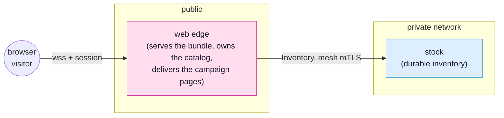

<!-- SPDX-FileCopyrightText: 2026 Alexandre 'kidev' Poumaroux -->
<!-- SPDX-License-Identifier: Apache-2.0 -->

# The light storefront

Every view a SynQt client can show is normally compiled into the bundle a visitor
downloads, which is why the bundle is honest about its size: what you shipped is what
they got. That is the right default, and it is the wrong one for a page that changes
weekly and that most visitors never open. This tutorial is about the other kind of
route, the one the web edge delivers on demand, and about being careful with it,
because a page that arrives at run time is a page that arrived from the network.

You will build a small storefront called the stall. Its product grid and cart are
compiled in, like everything you have written so far. Its marketing campaign pages are
not: they live on the edge, they are fetched the first time somebody opens one, and a
merchandiser can rewrite one without rebuilding a client or asking a visitor to reload
anything.

## What you will build

A three entity shop. The browser talks only to the web edge; the edge owns the live
catalog, delivers the campaign pages, and is the only thing that reaches the database
holding the durable stock.



The finished app is
[`examples/stall`](https://github.com/Kidev/SynQt/tree/main/examples/stall), so you can
read the whole thing at any point, or run it if a step goes sideways.

## What you will learn

- How a route table splits into pages the bundle carries (`view:`) and pages the edge
  delivers (`remote:`), and why the choice belongs to the route rather than to the code
  in it.
- What a delivered page is allowed to do: `router.palette`, the list of modules such a
  page may import, and why that list is a trust boundary rather than a convenience.
- How to paint a delivered page's first frame with real content, using a page seed that
  runs on the edge, per request, before the page is sent.
- How caching keeps the second visit cheap: the page body travels once, under a content
  hash, while the seed stays fresh on every navigation.
- Why a `scope:` on a delivered page protects that page's markup and never its data,
  and where the check that does protect data actually lives.
- How to give a delivered page a real URL, one a visitor can bookmark, refresh, edit by
  hand, and reach with the Back button.

## Before you start

Do [the auction](tutorial.md) first, or at least
[the base case](tutorial-base-auction.md) and
[a permanent Hall of Fame](tutorial-hall-of-fame.md). The stall's catalog and its
database entity are the auction's pattern with different nouns, so this tutorial keeps
them brief and spends its pages on what is new. If connect points, `Caller`, and a
database entity behind the edge are already familiar, nothing here will be a surprise.

Then create this tutorial's project and leave it running:

```cli
synqt new stall
```

Answer no to authentication and no to starting entities. You will write the route
table, the campaign page, and the seed yourself, and you can lift the catalog and the
`stock` entity straight from
[`examples/stall`](https://github.com/Kidev/SynQt/tree/main/examples/stall) when you
want them.

```cli
cd stall
synqt dev
```

> [!IMPORTANT]
> Keep `synqt dev` running in this terminal for the whole tutorial. It watches your
> files and reloads the browser when you save, and it reloads a delivered page without
> rebuilding the client, which is the point of half of what follows.

## The three parts

1. [Build it](tutorial-remote-pages-build.md): the route table, the palette, the
   campaign page on the edge, and the seed that paints its first frame. At the end of
   it the storefront runs.
2. [Lighter and live](tutorial-remote-pages-live.md): three hands-on checks that make
   the weight saving and the live editing concrete, and the one boundary an
   edge-delivered page never crosses.
3. [Links that work](tutorial-remote-pages-urls.md): the other half of a route, its
   URL, and what a visitor may do to the address bar without breaking anything.

> [!NOTE]
> This tutorial is the friendly front door. The reference behind it is
> [remote pages](remote-pages.md) for what the edge delivers and how,
> [routes and URLs](routing.md) for the route table and the address bar, and
> [security](security.md#remote-pages-edge-delivered-qml) for the trust position of a
> page that arrives at run time.
