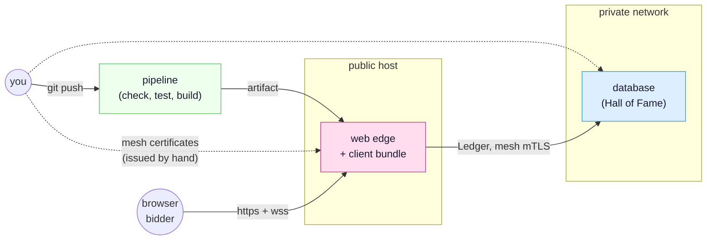

<!-- SPDX-FileCopyrightText: 2026 Alexandre 'kidev' Poumaroux -->
<!-- SPDX-License-Identifier: Apache-2.0 -->

# Shipping it

Everything you have built so far ran on one machine, under `synqt dev`, with a
throwaway certificate authority and a browser talking plaintext to localhost. That is
the right way to develop and it is not a deployment. This tutorial takes the auction
you already have and puts it somewhere else: on hosts you do not sit in front of,
built by a pipeline you did not run by hand, reachable by people who are not you.

A deployment adds four things to what `synqt dev` gave you for free, and only four.
Real certificates, real secrets, real TLS to the browser, and something that keeps the
processes running. Everything else in this tutorial is about arranging those four so
that the arrangement survives the second deploy, and the tenth, and the one somebody
else does at two in the morning.

## What you will build

A pipeline and two hosts. The pipeline checks, tests and builds on every push, and
produces the artifact you deploy. One host faces the internet and runs nothing else.
One host runs the database and is reachable only from the first. The certificate
authority that lets those two trust each other lives on neither of them.

## What you will learn

- How to ask the production question before you have a production: what
  `synqt check --release` adds to the check you already run, and why a profile file is
  the way to keep one topology instead of two copies of it.
- What belongs in a pipeline and what deliberately does not. Your CI builds the system
  and never holds the key that lets entities trust each other, and that is a decision
  rather than an omission.
- The two kinds of certificate a SynQt system uses, who issues each, and which one your
  users' browsers have ever heard of.
- Where every file goes on a host, and why a SynQt deployment is a project directory
  rather than a binary you can copy anywhere.
- What a release is here: a tag, an artifact, a start order, and, if you ship a desktop
  client, a decision about signing that no framework can make for you.
- How to change a running system: a new build, a rotated certificate, a rollback, and
  what each of the three costs in downtime.

## Before you start

Do [the auction](tutorial.md) first, all three stages. This tutorial deploys that exact
project, and it assumes you have `gavel` on disk with its web edge and its database
entity, signing in through GitHub.

You will also need, or will want to pretend you have:

- A git host that runs CI. The pipeline here is written for GitHub Actions; the shape
  is four commands, so translating it is mechanical.
- Two Linux hosts you can reach over SSH. Two containers, two virtual machines or two
  cloud instances all work. If you have one, run both entities on it and read the parts
  about the private network as the thing to fix later.
- A domain name pointing at the public host, and a public TLS certificate for it. Any
  ACME client will do; this tutorial does not care which.

Nothing here needs a hosting provider, an orchestrator or a container registry. Every
step is a file you write and a command you run, so that when you do put it behind an
orchestrator you know what it is doing for you.

> [!NOTE]
> Do the whole thing on one machine first if that is what you have. Two SSH targets
> that are both `localhost` teach the same lessons in the same order, and the only step
> that changes is the address you put in `synqt.production.yaml`.

## The four parts

1. [The pipeline that says no](tutorial-ship-pipeline.md): the production profile, the
   four commands, and the CI workflow that runs them on every push. At the end of it a
   push produces a deployable artifact, and a mistake stops being deployable.
2. [Two authorities](tutorial-ship-certificates.md): the private CA your entities trust
   and the public certificate your visitors trust, who holds each, and what happens
   when one expires.
3. [Where the binaries go](tutorial-ship-hosts.md): the shape of a deployed project,
   the two hosts, the service units that keep it alive, and the first boot.
4. [Cutting a release](tutorial-ship-release.md): tagging, the desktop client and its
   signing decision, the licence obligations a shipped client carries, and how to
   upgrade, roll back and rotate without taking the auction down.

> [!NOTE]
> This tutorial is the friendly front door. The reference behind it is
> [deploying a SynQt system](deploying.md) for the ordered checklist,
> [build system and CLI](build-system-and-cli.md) for every command and flag,
> [security](security.md) for the trust model the deployment is arranging, and
> [licensing](licensing.md) for what shipping a client obliges you to publish.
